# C#

## 七.类和集成

### 使用基类的引用

派生类的实例由基类的实例加上派生类新增的成员组成。可以通过**类型转换符**和**派生类对象的引用**获得基类部分的引用：

```cs
    class MyBaseClass
    {
        public void Print()
        {
            Console.WriteLine("This is the base class");
        }
    }
    class MyDerivedClass: MyBaseClass
    {
        new public void Print() // 使用 new 修饰符 告诉编译器需要屏蔽基类的同名方法
        {
            Console.WriteLine("This is the dervied class");
        }
    }
        class Program
    {
        static void Main(string[] args)
        {
             MyDerivedClass dervied = new MyDerivedClass();
             MyBaseClass mybc = (MyBaseClass)dervied;
             dervied.Print(); // This is the base class
             mybc.Print(); // This is the dervied class
        }
    }
```

**虚方法**：使用基类的引用可以访问到派生类的成员
  - 方法具有相同的签名和返回类型，可访问性也需要一致
  - 基类方法用 `virtual` 标注
  - 派生类方法用 `override` 标注
  - 不能复写 `static` 方法或非虚方法
  - 方法、属性和索引器都可以被声明为`virtual`和`override`

```cs
    class MyBaseClass
    {
        virtual public void Print()
        {
            Console.WriteLine("This is the base class");
        }
    }
    class MyDerivedClass: MyBaseClass
    {
        override public void Print()
        {
            Console.WriteLine("This is the dervied class");
        }
    }
    class Program
    {
        static void Main(string[] args)
        {
             MyDerivedClass dervied = new MyDerivedClass();
             MyBaseClass mybc = (MyBaseClass)dervied;
             dervied.Print(); // This is the dervied class
             mybc.Print(); // This is the dervied class
        }
    }
```

注意：无论继承的层次有多少，如果使用基类部分的引用去调用一个覆写方法时，会根据派生层往上寻找，直到找到最高派生层对应被标记的`override`方法

```cs
    class MyBaseClass
    {
        virtual public void Print()
        {
            Console.WriteLine("This is the base class");
        }
    }
    class MyDerivedClass: MyBaseClass
    {
        override public void Print()
        {
            Console.WriteLine("This is the dervied class");
        }
    }
    class SecondDerived: MyDerivedClass
    {
        override public void Print()
        // new public void Print() // 如果此处用的是 new，则下面 Main 中第二个应打印 This is the dervied class
        {
            Console.WriteLine("This is the second deroved class");
        }
    }
    class Program
    {
        static void Main(string[] args)
        {
             SecondDerived dervied = new SecondDerived();
             MyBaseClass mybc = (MyBaseClass)dervied;
             dervied.Print(); // This is the second deroved class
             mybc.Print(); // This is the second deroved class
        }
    }
```

### 构造函数的执行

创造一个派生类的实例过程：初始化对象的所有实例成员——>调用基类无参数构造函数——>执行自己的构造函数体

因为构造函数可以重载，如果希望派生类使用一个指定的构造函数而不是无参数的构造函数，需要在*构造函数初始化语句*中指定：（两种形式）
  - 第一种：使用关键字`base`指明希望使用的基类构造函数（即指定执行继承类的哪一个构造函数）
  - 第二种：使用关键字`this`指明应该使用当前类的哪一个构造函数（即指定先执行当前类的哪一个构造函数）

  ```cs
        // 类 MyBaseClass 的构造函数
        public MyBaseClass(string s, int x)
        {
            // 执行代码
        }
        // 类 MyDerivedClass 的构造函数
        public MyDerivedClass(int x, string s): base(s, x)
        {
            // 执行代码
        }
        // 第二种方式
    class MyBaseClass
    {
        public MyBaseClass()
        {
            Console.WriteLine("this is MyBaseClass constructor");
        }
    }
    class MyDerivedClass: MyBaseClass
    {
        readonly int firstVar;
        readonly double secondVar;
        public string UserName;
        private MyDerivedClass()
        {
            firstVar = 20;
            secondVar = 30.5;
            Console.WriteLine("this is first constructor");
        }
        public MyDerivedClass(string firstName): this()
        {
            UserName = firstName;
            UserIdNumber = -1;
            Console.WriteLine("this is second constructor");
        }
    }
    // Main
    MyDerivedClass dervied = new MyDerivedClass("test");
    // 打印
    // this is MyBaseClass constructor
    // this is first constructor
    // this is second constructor
  ```

**类的可访问级别**：
- public：可以被系统内任何程序集中的代码访问
- internal：只能被自己所在的程序集内的类访问（默认的访问级别）

### 程序集间的继承

C# 允许在不同的程序集内定义的基类来派生类：也就是只要 A程序集的一个基类显示声明 `public`,当在VS添加对包含基类的程序集的引用时，就能够在 B程序集内继承 A程序集的类

如果要引用其他程序集中的类和类型，可以在文件顶部放置一个`using`指令，并带上将要访问的类或类型所在的命名空间

**注意**，添加引用和增加`using`指令是两回事，添加引用时告诉编译器所需的类型在哪里定义；增加`using`指令时允许引用其他的类而不必使用它们的完全限定名称

```cs
// ClassDemo 程序集（项目）
namespace ClassDemo.BaseClassNS
{
    public class BaseClass
    {
        public void PrintMe()
        {
            Console.WriteLine("I am BaseClass");
        }
    }
}
// HelloWorld 程序集（项目）
using ClassDemo.BaseClassNS;

namespace HelloWorld
{
    class DerivedClass: BaseClass
    {
    }
    class Program
    {
        static void Main(string[] args)
        {
            DerivedClass mdc = new DerivedClass();
            mdc.PrintMe(); // I am BaseClass
        }
    }
}
```

### 成员访问修饰符

通用内容:
- 所有在同一类中显示声明的成员，在同一类中都是可见的，无论访问性如何
- 继承的成员不在类的声明中显式声明，所以继承的成员对派生类的成员既可以是可见的，也可以是不可见的
- 五种访问级别：public、private、protected、internal、protected internal
- 必须对每个成员指定访问级别，不指定默认为private
- 成员不能比所在类有更高的访问性，如果类仅限于所在的程序集访问，则它成员也不能从程序集外部访问
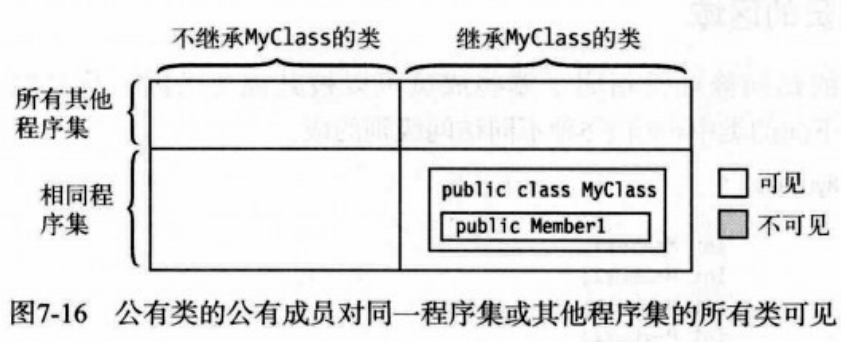
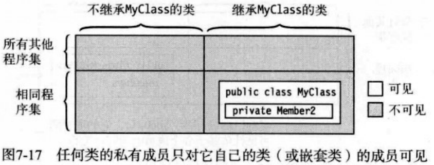
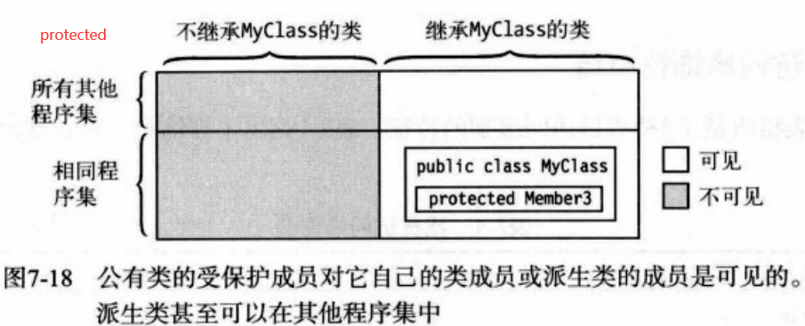
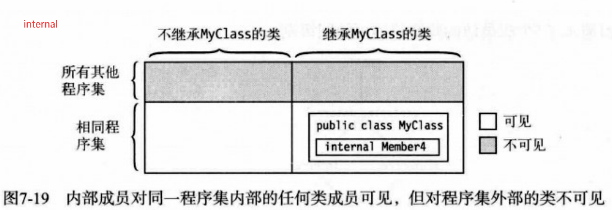
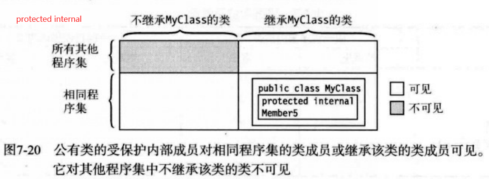

**总结**：
- private：只在类的内部可访问
- internal：对该程序集内的所有类可访问
- protected：对所有继承该类的类可访问
- protected internal：对所有继承该类或在该程序集内声明的类可访问
- public：对任何类可访问


### 抽象成员

**抽象成员**是指设计为被覆写的函数成员：
- 必须是函数成员，即方法、属性、事件、索引（字段和常量不能是抽象成员）
- 必须用 `abstract`修饰符标记
- 不能有实现代码
- 只能在抽象类中声明
- 抽象成员在派生类中必须被覆写，但`virtual`修饰符不能附加到`abstract`上
- 类似虚成员，派生类中的抽象成员实现必须指定`override`修饰符

```cs
    abstract class Example2
    {
        abstract public void PrintStuff(string s);
        abstract public int MyProperty
        {
            get;
            set;
        }
    }
```

**抽象类**是指设计为被继承的类：
- 抽象类只能用作其他类的基类，不能创建实例
- 使用`abstract`修饰符声明
- 抽象类的成员可以包含普通成员和抽象成员
- 抽象类可以派生自另外一个抽象类
- 任何派生自抽象类的类必须使用`override`关键字实现该类的所有抽象成员，除非派生类自己也是抽象类
```cs
    abstract class AbClass
    {
        abstract public void PrintStuff(string s);
        public void IdentifyBase() 
        {
            Console.WriteLine("I am AbClass");
        }
    }
    class MyAbClass: AbClass
    {
        override public void PrintStuff(string s)
        {
            Console.WriteLine("{0}", s);
        }
    }
    class Program
    {
        static void Main(string[] args)
        {
            MyAbClass mab = new MyAbClass();
            mab.PrintStuff("test"); // test 调用抽象方法
            mab.IdentifyBase(); // I am AbClass 调用继承的方法
        }
    }
```

### 密封类

**密封类**刚好与抽象类相反
- 只能被用作独立的类，不能用作基类
- 使用`sealed`修饰符标注
```cs
    sealed class MyClass 
    {
        // 
    }
```

### 静态类

**静态类**中的所有成员都是静态的，用于存放不受实例数据影响的数据和函数，常见的用途是创建一个包含一组数学方法和值的数学库
- 使用`static`修饰符标注
- 所有成员都是静态的
- 类可以有一个静态构造函数，但不能有实例构造函数，不能创建该类的实例
- 静态类是隐式密封的，所以不能继承静态类
- 使用类名和成员名访问

```cs
    static class MyMath
    {
        public static float PI = 3.14f;
        public static bool IsOdd(int x)
        {
            return x % 2 == 1;
        }
        public static  int Times2(int x)
        {
            return 2 * x;
        }
    }
    class Program
    {
        static void Main(string[] args)
        {
            int val = 3;
            Console.WriteLine("{0} is Odd is {1}", val, MyMath.IsOdd(val));
            Console.WriteLine("{0} * 2 = {1}", val, MyMath.Times2(val));
        }
    }
```

### 扩展方法

**扩展方法**允许编写的方法和声明它的类之外的类关联
- 声明扩展方法的类必须声明为`static`
- 扩展方法本身必须声明为`static`
- 扩展方法必须包含关键字`this`作为它的第一个参数类型，并在后面跟着它所扩展的类的名称

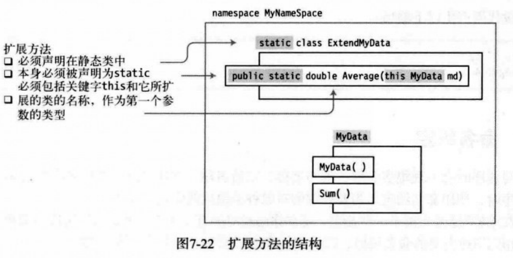

```cs
sealed class MyData
    {
        private double D1;
        private double D2;
        private double D3;
        public MyData(double d1, double d2, double d3)
        {
            D1 = d1;
            D2 = d2;
            D3 = d3;
        }
        public double Sum()
        {
            return D1 + D2 + D3;
        }
    }
    static class ExtendMyData
    {
        public static double Average(this MyData md)
        {
            return md.Sum()/3;
        }
    }
    class Program
    {
        static void Main(string[] args)
        {
 
            MyData md = new MyData(3, 4, 5);
            Console.WriteLine("Average: {0}", ExtendMyData.Average(md)); // 静态调用形式
            Console.WriteLine("Average: {0}", md.Average()); // 当作类的实例成员调用 等价于上一行
        }
    }
```

## 八.表达式和运算符

### 表达式

**运算符**是一个符号，表示返回单个结果的操作

**操作数**是指作为运算符输入的数据元素，有：
- 字面量
- 常量
- 变量
- 方法调用
- 元素访问器
- 其他表达式

**表达式**是运算符和操作数的字符串

### 字面量

**字面量**是源代码中键入的数字或字符串，表示一个指定类型的明确的、固定的值

eg:
```cs
    static void Main() {
        Console.WriteLine("{0}", 1024); // 整数字面量
        Console.WriteLine("{0}", 3.1416); // 双精度字面量
        Console.WriteLine("{0}", 3.1416F); // 浮点型字面量
        Console.WriteLine("{0}", true); // 布尔型字面量
        Console.WriteLine("{0}", 'x'); // 字符型字面量
        Console.WriteLine("{0}", 'Hi there'); // 字符串型字面量
    }
```

**整数字面量**最常用的字面量，没有小数点，带可选的后缀，指明整数类型


**实数字面量**组成：
- 十进制数字
- 一个可选的小数点
- 一个可选的指数部分
- 一个可选的后缀

eg:
```cs
    float f1 = 236F;
    dpuble d1 = 236.714;
    double d2 = .35192;
    double d3 = 6.338e-26;
```

**字符字面量**由两个单引号内的字符组成，类型为`char`，可以是
- 单个字符
- 一个简单转义序列
- 一个十六进制转义序列
- 一个`Unicode`转义序列

eg:
```cs
    char c1 = 'd'; // 单个字符
    char c2 = '\n'; // 简单转移序列
    char c3 = '\x0061'; // 十六进制转义序列
    char c4 = '\u005a'; // Unicode转义序列
```


**字符串字面量**由双引号标记，分为两种：
- 常规字符串字面量
- 逐字字符串字面量：以`@`字符为前缀，双引号内的转义字符串不会被求值

eg：
```cs
    string rst1 = "Hi there!"; // Hi there!
    string vst1 = @"Hi there!"; // Hi there!

    string rst2 = "Value 1 \t 5, Val2 \t 10"; // Value 1     5, Val2     10 解释制表符转义字符串
    string vst2 = @"Value 1 \t 5, Val2 \t 10"; // Value 1 \t 5, Val2 \t 10 不解释制表符
```

### 求值顺序

**运算符优先级**
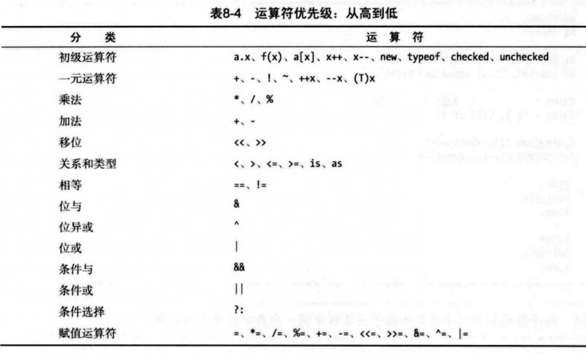

**运算符结合性**：当两个连续的运算符有相同的优先级时，根据操作结合性判断优先级：
- 左结合运算符从左至右求值
- 右结合运算符从右至左求值
- 除赋值运算符以外，其他*二元运算符都是左结合*
- *赋值运算符和条件运算符都是右结合*

此外可以用**圆括号**显式设定子表达式的求值顺序，从嵌套的最内层到最外层顺序


### 简单算术运算符

**简单算术运算符**执行基本的四则运算（加减乘除），都是二元*左结合*运算符

### 求余运算符

**求余运算符**(%)是用第二个操作数除第一个操作数，忽略商，返回余数，是二元*左结合*运算符

eg：
```cs
    0 % 3 = 0; // 0除以3得0余0
    1 % 3 = 1; // 1除以3得0余1
    2 % 3 = 2; // 2除以3得0余2
    3 % 3 = 0; // 3除以3得1余0
    4 % 3 = 1; // 4除以3得1余1 
```

### 关系比较运算符和相等比较运算符

**关系比较运算符**和**相等比较运算符**都是二元*左结合*运算符：
- 小于：<
- 大于：>
- 小于等于：<=
- 大于等于：>=
- 等于：=
- 不等于：!=

**引用类型比较**，只比较它们的*引用*:
- 引用相等，也就是说指向内存相同对象，则相等性比较为`true`,否则为`false`
- 是一种浅比较

注意，`string`类型对象也是引用类型，但它的比较方式不同于上述，它们比较的是长度和内容（区分大小写），是一种深比较；*委托*也是引用类型，使用的是深比较

### 递增运算符和递减运算符

**递增运算符**和**递减运算符**都是二元*左结合*运算符，分别对操作数加1、减1：
- 前置形式：++x或--y
- 后置形式：x++或y--

|   表达式：x=10    |   返回表达式的值  |   计算后变量的值   |
|   ------------    |   -------------   |   -------------   |
|       ++x         |       11          |       11          |
|       x++         |       10          |       11          |
|       --x         |        9          |        9          |
|       x--         |       10          |        9          |
 
### 条件逻辑运算符

**逻辑运算符**用于比较或否定它们的操作数的逻辑值：
- 逻辑与(&&)和逻辑或(||)是二元*左结合*运算符，逻辑非(!)是一元运算符
- 逻辑与(&&)和逻辑或(||)使用*短路*模式，如果前一个表达式为`false`则不会执行后一个表达式

### 逻辑运算符

**按位逻辑运算符**用于设置位组的方法参数，除了*按非*是一元运算符外，其他都是二元*左结合*运算符

### 移位运算符

**按位移位运算符**是指向左或向右把位组移动指定数量个位置，空出的位用0或1填充，都是二元*左结合*运算符

### 赋值运算符

**赋值运算符**是二元*右结合*运算符

### 条件运算符

**条件运算符**是基于条件的结果，返回两个值之一的三元运算符

### 一元算术运算符

**一元算术运算符**设置数字值的符号

### 用户定义运算符

**用户定义的类型转换**可以为自己的类或结构定义隐式转换和显式转换，即可将用户定义类型的对象转换成某个其他类型：
- 隐式转换：当决定载特定的上下文中使用特定类型时，如有必要，编译器会自动执行转换，使用`implicit`关键字
- 显式转换：编译器只在使用显式转换运算符时才执行转换，使用`explicit`关键字

**显式转换**，需要在转换时用上*强制转化运算符*，由一对圆括号加上目标类型组成

```cs
    class LimitedInt
    {
        const int MaxValue = 100;
        public int MinValue = 0;
        public static implicit operator int(LimitedInt li)
        {
            Console.WriteLine("1");
            return li.TheValue;
        }
        public static explicit operator LimitedInt(int x)
        {
            Console.WriteLine("2");
            LimitedInt li = new LimitedInt();
            li.TheValue = x;
            return li;
        }
        private int _theValue = 0;
        public int TheValue
        {
            get {
                Console.WriteLine("get");
                return _theValue;
            }
            set
            {
                if (value < MinValue)
                {
                    _theValue = 0;
                } else
                {
                    Console.WriteLine("set");
                    _theValue = value > MaxValue ? MaxValue : value;
                }
            }
        }
        class Program {
            static void Main() {
                Limited li = 500; // 隐式转换
                int value = (int) li; // 显式转换
            }
        }
        // 执行顺序为
        // 2 set 1 get get li: 100, value: 100
    }
```

### 运算符重载

**运算符重载**允许用户定义C#运算符如何操作自定义类型的操作数：
- 运算符重载只能用于类和结构
- 为类或结构重载一个运算符x，可以声明一个名称为`operator x`的方法并实现它的行为
- 一元运算符的重载方法带一个单独的`class`或`struct`类型的参数
- 二元运算符的重载方法带两个参数，至少有一个必须是`class`或`struct`类型
- 声明时必须同时使用`public`和`static`修饰符
- 运算符必须是操作类或结构的成员

eg:
```cs
    class LimitedIntOverLoad
    {
        const int MaxValue = 100;
        const int MinValue = 0;
        public static LimitedIntOverLoad operator -(LimitedIntOverLoad x)
        {
            Console.WriteLine("1");
            LimitedIntOverLoad li = new LimitedIntOverLoad();
            li.TheValue = 0;
            return li;
        }
        public static LimitedIntOverLoad operator -(LimitedIntOverLoad x, LimitedIntOverLoad y)
        {
            Console.WriteLine("2");
            LimitedIntOverLoad li = new LimitedIntOverLoad();
            li.TheValue = x.TheValue - y.TheValue;
            return li;
        }
        public static LimitedIntOverLoad operator +(LimitedIntOverLoad x, double y)
        {
            Console.WriteLine("3");
            LimitedIntOverLoad li = new LimitedIntOverLoad();
            li.TheValue = x.TheValue + (int)y;
            return li;
        }
        private int _theValue = 0;
        public int TheValue
        {
            get
            {
                Console.WriteLine("get");
                return _theValue;
            }
            set
            {
                if (value < MinValue)
                {
                    _theValue = 0;
                }
                else
                {
                    Console.WriteLine("set");
                    _theValue = value > MaxValue ? MaxValue : value;
                }
            }
        }
    }
    class Program () {
        static void Main() {
            LimitedIntOverLoad li1 = new LimitedIntOverLoad();
            LimitedIntOverLoad li2 = new LimitedIntOverLoad();
            LimitedIntOverLoad li3 = new LimitedIntOverLoad();
            li1.TheValue = 10;
            li2.TheValue = 26;
            Console.WriteLine("li1:{0}, li2: {1}", li1.TheValue, li2.TheValue); // 10 , 26
            li3 = -li1;
            Console.WriteLine("-{0} = {1}", li1.TheValue, li3.TheValue); // -10 = 0
            li3 = li2 - li1;
            Console.WriteLine("{0} - {1} = {2}", li2.TheValue, li1.TheValue, li3.TheValue); // 26 - 10 = 16
            li3 = li1 - li2;
            Console.WriteLine("{0} - {1} = {2}", li1.TheValue, li2.TheValue, li3.TheValue); // 10 - 26 = 0
        }
    }
```

注意。并不是所有运算符都能够重载，只有以下几种才可以：
- 一元运算符：+、-、!、~、++、--、true、false
- 二元运算符：+、-、*、/、%、&、|、^、<<、>>、== 、!==、<、>、<=、>=
- 递增和递减运算符也能重载，但无后置前置之分

**重载运算符不能做的事情**：
- 创建新得运算符
- 改变运算符的语法
- 重新定义运算符如何处理预定义类型
- 改变运算符的优先级或结合性

### typeof 运算符

**typeof运算符**返回作为其参数的任何类型的`System.Type`对象，不能重载的一元运算符

eg:
```cs
    class SomeClass
    {
        public int Field1;
        public int Field2;
        public void Method1() { }
        public int Method2()
        {
            return 1;
        }
    }

    // Program.cs
    using System.Reflection;
    class Program {
        Type t = typeof(SomeClass);
        FieldInfo[] fi = t.GetFields();
        MethodInfo[] mi = t.GetMethods();
        foreach (FieldInfo f in fi)
            Console.WriteLine("Field: {0}", f.Name);
        foreach (MethodInfo m in mi)
            Console.WriteLine("Method: {0}", m.Name);
        //Field: Field1
        //Field: Field2
        //Method: Method1
        //Method: Method2
        //Method: GetType
        //Method: ToString
        //Method: Equals
        //Method: GetHashCode
    }
```

## 九.语句

### 什么是语句

**语句**是描述某个类型或让程序执行某某个动作的源代码指令：
- 声明语句 声明类型或变量
- 嵌入语句 执行动作或管理控制流
- 标签语句 控制跳转

*空语句*由一个分号组成


### 表达式语句

`x=10;`这个表达式把运算符右边的值赋给变量x引用的内存位置，虽然这可能是这条语句的主要动机，但却被视为*副作用*

### 控制流语句

**条件执行语句**是指依据一个条件执行或跳过 一个代码片段：
- if
- if...else
- switch

**循环语句**是指重复执行一个代码片段：
- while
- do
- for
- foreach

**跳转语句**是指把控制流从一个代码片段改变到另一个代码片段中的指定语句：
- break
- continue
- return
- goto
- throw

*注意*，条件执行和循环结构必须有一个**测试表达式**或**条件**决定程序在哪里继续执行，这个测试表达式必须返回`bool`型值


### if语句
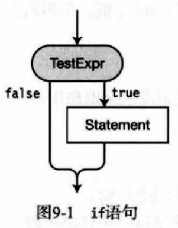

### if...else语句
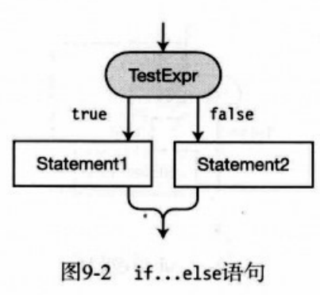

### while语句
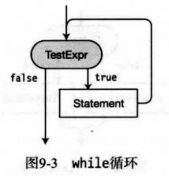

### do循环
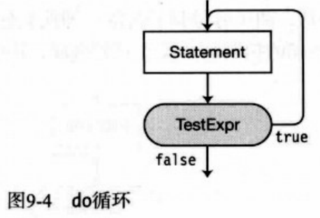

### for循环
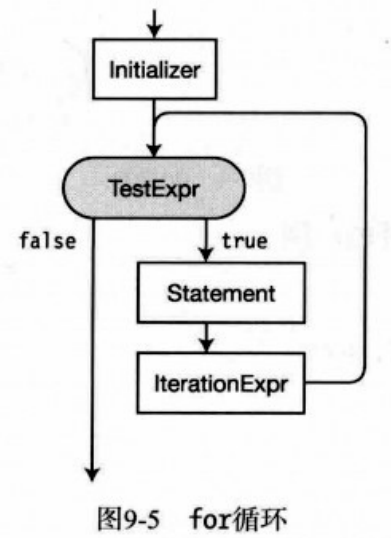

**for循环**表达式：
```cs
    for( Initializer ; TestExpr; IterationExpr )
        statement
```
- for循环开始，**只执行一次** Initializer
- 对 TestExpr 求值，为 true 则执行 statement，接着执行 IterationExpr
- 再重复执行一步，如果为 false 就执行 statement 以外的语句

eg:
```cs
    for(int i = 0; i < 3; i++) // 注意变量 i 值在 for 语句的内部可见
    {
        Console.WriteLine("i: {0}", i);
    }
    // 0 1 2
```
**注意**：
- 任何声明在 initializer中的变量只在 for语句中可见
- 初始化和迭代表达式都可以包含多个表达式，用逗号隔开

### switch语句

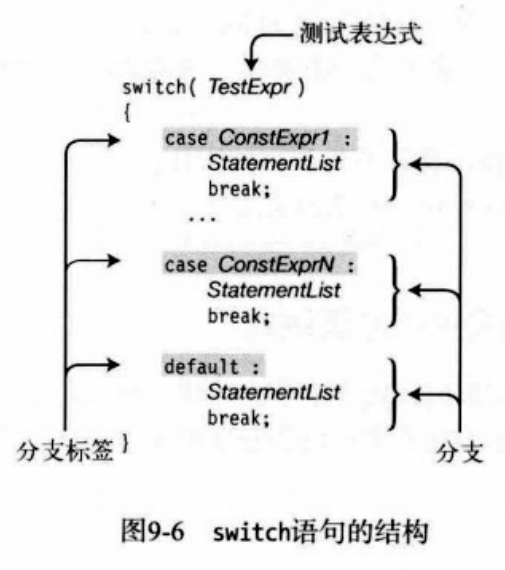

**注意**：
- 一个`switch`语句可以有任意数目的分支，包括没有分支，`default`段不是必须的，但有`default`段可以捕获潜在错误，是个好习惯
- `case`关键字后的分支标签必须是一个常量表达式，也就是说必须在*编译时*就完全获取运算结果，且类型应与测试表达式的一致
- 每一个`switch`段，包括可选的`default`段，都必须以一个跳转语句结尾
- C#中不可执行一个`switch`段中的代码就直接执行下一个段的代码

eg:
```cs
    for( int x = 1; x < 6; x++ )
    {
        switch(x)
        {
            case 2:
                Console.WriteLine("x is {0} -- In Case 2", x);
                break;
            case 3:
                Console.WriteLine("x is {0} -- In Case 3", x);
                break;
            case 4:
                Console.WriteLine("x is {0} -- In Case 4", x);
                break;
            default:
                Console.WriteLine("x is {0} -- In Default case", x);
                break;
        }
        //x is 1-- In Default case
        //x is 2-- In Case 2
        //x is 3-- In Case 3
        //x is 4-- In Case 4
        //x is 5-- In Default case
    }
```

### 跳转语句

**跳转语句**包括：break; continue; return; goto; throw;

### break语句

**break语句**可用于 switch、for、foreach、while、do等语句中，`break`导致执行跳出*最内层封装语句*

### continue语句

**continue语句**可用于 while、do、for、foreach等语句中，`continue`导致执行跳出最内层封装语句的*顶端*

```cs
    for(int x = 0; x < 5; x++)
    {
        if (x < 3)
            continue;
        Console.WriteLine("Value of x is {0}", x);
        // Value of x is 3
        // Value of x is 4
    }
```

### 标签语句

**标签语句**：由一个*标识符*后面跟着一个*冒号*再跟着*一条语句*组成：
- Indentifier: Statement;
- 标签语句只执行`Statement`部分，这个标签是用于允许控制流从代码的其他部分转移到该语句
- 标签语句只能用于*块内部*，作用域范围在它声明的块内（和任何嵌套在该块内部的块）

**标签**标签语句中的表示符可以是任何有效的标识符，包括在重叠作用域内声明的标识符如本地变量或参数名：
- 不能是关键字
- 不能在重叠的范围内与另外一个标签标识符相同

### goto语句

**goto语句**：无条件转移控制到一个*标签语句*，结构是：
- goto Indentifier;
- goto语句必须在标签语句的*作用域之内*
- goto语句可以*跳到*它本身所在块内的任何标签语句，或*跳出*到任何它*被嵌套*的块内的标签语句
- goto语句不能*跳入*任何嵌套在该语句本身所在块内部的任何块
- 还可用于`switch`语句，即：goto case ConstantExpr; 和 goto default;

### using语句

**using语句**能帮助减少意外的运行时错误带来的潜在问题，它整洁地包装了资源地使用，有两种形式：
- using( ResourceType Identifier = Expression ) Statement  
-                  ↑分配资源                     ↑使用资源
- using( Expression ) EmbeddedStatement
-         ↑资源          ↑使用资源

注意：
- using语句不同于using指令

### 其他语句


## 十.结构

### 什么是结构

**结构**是程序员定义的数据类型：
- 与类相似，有数据成员和函数成员
- 结构是值类型，类是引用类型
- 结构是隐式密封的，不能被派生
- 用关键字`struct`声明

eg：
```cs
    struct Point
    {
        public int x;
        public int y;
    }
```

### 结构是值类型

结构变量含有自己的数据：
- 结构类型的变量不能为`null`
- 两个结构变量不能引用同一个对象

```cs
    struct Simple
    {
        public int x;
        public int y;
    }
    class CSimple
    {
        public int x;
        public int y
    }
    class Program {
        static void Main() {
            CSimple cs = new CSimple();
            Simple ss = new Simple();
        }
    }
```

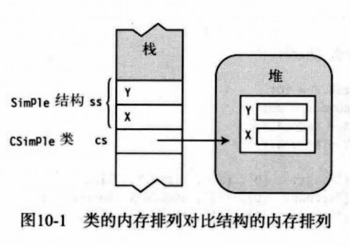

### 对结构赋值

```cs
    struct Simple
    {
        public int x;
        public int y;
    }
    class CSimple
    {
        public int x;
        public int y
    }
    class Program
    {
        static void Main(string[] args)
        {
        CSimple cs1 = new CSimple(), cs2 = null;
        Simple ss1 = new Simple(), ss2 = new Simple();
        cs1.x = ss1.x = 5;
        cs1.y = ss1.y = 10;
        cs2 = cs1;
        ss2 = ss1;
        }
    }
```
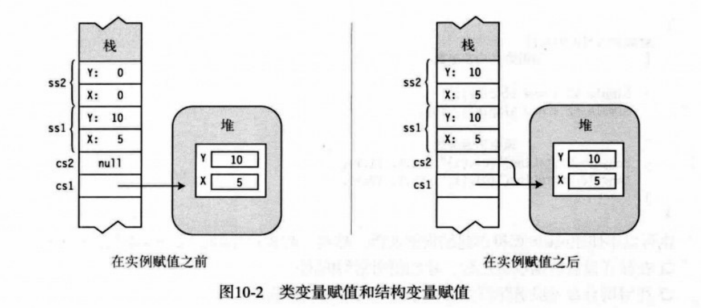

### 构造函数和析构函数

注意：结构可以有实例构造函数和静态构造函数，*不能*有析构函数

**结构的实例构造函数**：语言隐式为每个结构提供一个无参构造函数
- 预定义的无参构造函数不允许删除或重定义
- 只能自定义含参的实例构造函数
- 也可以不通过`new`运算符创建结构实例，但会有一些限制：
    - 在显式设置数据之后，才能使用它们的值，否者编译器会报错
    - 在对所有数据成员赋值之后，才能*调用任何*函数成员


**静态构造函数**：创建并初始化静态数据成员，不能引用实例成员：
- 调用显式声明的构造函数
- 引用结构的静态成员

### 字段初始化时是不允许的

```cs
    struct Simple {
        public int x = 10; // 不允许，编译错误
    }
```

### 结构是密封的

**结构总是隐式密封**。不能继承，所以不能用于结构的修饰符：protected、internal、abstract、virtual

结构本身派生自`System.ValueType`,而`System.ValueType`派生自`Object`

### 装箱和拆箱

目的：将一个结构实例作为引用类型对象，创建*装箱*的副本

装箱：是指制作值类型变量的引用类型副本

### 结构作为返回值和参数

**结构**可以用作*返回值*和*参数*：
- 返回值时，将创建它的副本并从函数成员返回
- 参数时，将创建实参结构的副本，该副本用于方法的执行中
- ref和out参数，传入方法的是该结构的一个引用，这样就能修改其数据成员


## 十一.枚举

### 枚举

**枚举**是自定义的类型，与类和结构一样：
- 枚举是*值类型*，直接存储数据
- 枚举只有一种类型成员: 命名的整数值常量
- 用关键字`enum`声明
- 成员声明列表用*逗号*分隔，在枚举声明中没有分号
- 每个枚举成员都被赋予一个底层类型(默认是整型)的常量值
- 默认情况下，编译器会把第一个值赋值0，并对每一个后续成员赋值比前一个成员多1

eg：
```cs
    enum TrafficLight {
        Green,
        Yellow,
        Red
    }
    class Program {
        static void Main() {
            TrafficLight t1 = 
        }
    }
```
**设置底层类型**：在声明时用冒号和类型加在声明后,所有成员常量都属于枚举的底层类型

eg:
```cs
    enum TrafficLight: ulong {
        //
    }
```

成员常量的值也可以是底层类型的任何值:如要显式设置一个成员的值，只需在枚举声明中的变量名后使用初始化表达式，不能有重复的变量名，但可有重复的值：

eg:
```cs
    enum TrafficLight {
        Green = 10,
        Yellow = 15,
        Red = 15
    }
```

### 位标志
    使用单个字的不同位作为表示一组开/关标志的紧凑方法

### 关于枚举的补充 

补充：
- 枚举只有单一的成员类型：声明的成员常量
- 不能对成员使用修饰符，它们都隐式地具有与枚举相同地可访问性
- 由于成员是常量，即使在没有该枚举类型地变量时它们也能被访问，使用枚举类型名跟点和成员名
- 比较不同枚举类型地成员会导致编译时错误（指的是同一个枚举中地成员比较不会出错，不同一个就会出错）

## 十二.数组

### 数组

**数组**是由一个变量名称表示的一组*同类型*的数据元素
- 元素：数组的独立数据项
- 秩/维度：数组可以有任何为正数的维度数（秩）
- 维度长度：朝一个方向的位置个数
- 数组长度：所有维度中的元素总和

注意：数组一旦创建，大小就固定，不支持动态数组

### 数组的类型

- 一维数组：单行元素或元素向量
- 多维数组：由主向量中的位置组成，每一个位置本身又是一个数组，称为子数组；
    - 矩形数组：
        - 某个维度的所有子数组有相同长度的多维数组
        - 不管有多少维度，总是使用一组方括号： `int x = myArray[4, 6, 1]
    - 交错数组：
        - 每一个子数组都是独立数组的多维数组
        - 可以有不同长度的子数组
        - 为数组的每一个维度使用一对方括号：`int y = jagArray[2][7][4]`


### 数组是对象

数组实例是从`System.Array`继承的对象，继承了很多有用的方法如：Rank(返回数组维度数的属性)、Length(返回数组的长度)；数组也是**引用类型**，但数组元素可以是值类型或引用类型


### 一维数组和矩形数组

**声明**一维数组或矩形数组：
- 在类型和变量名之间使用一对方括号
- 方括号内的逗号称为秩说明符，秩就是逗号数加1
- 不可再数组类型区域中放数组维度的长度，维度长度直到数组实例化才会确定

eg:
```cs
    int[,,] firstArray; // 正确
    int[,,,] array3; // 正确
    long[3,2,6] secondArray; // 错误示例，不能写维度长度，会出现编译错误
```

### 实例化一维数组或矩形数组

**数组创建表达式**：由 `new`运算符加基类名称和一对方括号组成

eg：
```cs
    int[] arr2 = new int[4]; // arr2数组是包含4个int的一维数组
    int[,,] arr3 = new int[3,6,2]; // arr3数组是三维数组
    MyClass[] mcArr = new MyClass[4]; // mcArr数组是包含4个MyClass引用的一维数组
```


### 访问数组元素

**访问数组元素**：使用整型值作为索引来访问数组元素
- 每一个维度的索引从0开始
- 方括号内的索引在数组名称之后

```cs
    class Example12
    {
        public void test ()
        {
            int[] intArr1 = new int[15];
            intArr1[2] = 10;
            int var1 = intArr1[2];

            int[,] intArr2 = new int[5, 10];
            intArr2[2, 3] = 7;
            int var2 = intArr2[2, 3];

            int[] myIntArray;
            myIntArray = new int[4];
            for( int i =0; i< 4;i++)
            {
                myIntArray[i] = i * 10;
            }
            for(int i = 0; i<4; i++)
            {
                Console.WriteLine("Value of element {0} = {1}", i, myIntArray[i]);
            }
        }
    }
    class Program
    {
        static void Main(string[] args)
        {
        Example12 eg12 = new Example12();
        eg12.test();
        }
        // Value of element 0 = 0
        // Value of element 1 = 10
        // Value of element 2 = 20
        // Value of element 3 = 30
    }
```
### 初始化数组

**数组初始化**：当数组被创建后，每一个元素被自动初始化为类型的默认值，对于预定义类型，整型默认值为0，浮点型默认值为0.0，布尔型默认值为false，引用类型默认值为null

**显式初始化一维数组**：显式初始化一维数组，可以在实例化的数组创建表达式后加上一个*初始化列表*
- 初始值必须用逗号分隔开，并封闭在一组大括号内
- 不必输入维度的长度，编译器直接根据初始化值得个数来推断
- 数组创建表达式和初始化列表之间没有分隔符

eg: `int[] intArr = new int[] {10, 20, 30, 40};`

**显式初始化矩形数组**：
- 每一个初始值向量必须封闭在大括号内
- 每一个维度必须嵌套并封闭在大括号内
- 除了初始值，每一个维度的初始化列表和组成部分也必须用逗号分隔开

eg: 

`int[,] intArray2 = new int[,] { {10, 1}, {2, 10}, {11, 9} };`


```
int[,,] intArray3 = new int[4, 3, 2] {
    { {8, 6}, {5, 2}, {12, 9} },
    { {6, 4}, {3, 9}, {18, 4} },
    { {7, 1}, {1, 3}, {29, 3} },
    { {4, 6}, {3, 2}, {23, 8} }
}
```
注意：当在一条语句中使用声明、数组创建和初始化时，可以**省略**数组的创建表达式部分，只提供初始化部分：


eg: 
```
    int[] arr1 = int[3] {10, 20, 30}; 
    等价于
    int[] arr1 =        {10, 20, 30};
```

**隐式类型数组**：
- 当初始化数组时，可以让编译器根据初始化语句推断数组类型，只要初始化语句能隐式转换为单个类型
- 和隐式类型的局部变量一样，使用`var`关键字来替代数组的类型
- 初始化语句中仍需要提供秩说明符

eg:
```
    var intArr2 = new [] {10, 20,  30, 40 };
    var intArr4 = new [,] { {10, 1}, {2, 10}, {11, 9} };
    var sArray1 = new [] { "life", "liberty", "pursuit of hanppiness" };
```

综合：
eg:
```cs
    var arr = new[,] { { 0, 1, 2 }, { 10, 11, 12 } };
                for(int i = 0; i < 2; i++)
                {
                    for(int j = 0; j<3; j++)
                   {
                       Console.WriteLine("Element [{0}, {1}] is  {2}", i, j, arr[i, j]);
                    }
                }
// Element [0, 0] is  0
// Element [0, 1] is  1
// Element [0, 2] is  2
// Element [1, 0] is  10
// Element [1, 1] is  11
// Element [1, 2] is  12
```

### 交错数组

**交错数组**：与矩形数组相比，交错数组的子数组元素个数可以不同

eg:
`int[][] jagArr = new int[3][]; // 一个二维的3个int数组的交错数组`


**声明交错数组**：
- 每一个维度都有一对独立的方括号，方括号数决定了数组的秩
- 交错数组的维度可以是大于1的任意整数
- 和矩形数组一样，维度长度不能包括在数组类型的声明部分

```cs
    int[][] someArr;
    int[][][] otherArr;
```

**实例化交错数组**：
- 首先，实例化顶层数组，不能在声明语句中初始化顶层数组之外的数组
- 其次，实例化每一个子数组，把新建数组的引用赋给它们所属数组的合适元素
```cs
    int[][] jagArr = new int[3][]; // 1. 正确
    int[][] jagArr = new int[3][4]; // 1. 编译错误

    jagArr[0] = new int[] {10, 20, 30}; //2. 
    jagArr[1] = new int[] {40, 50, 60, 70}; // 3. 
    jagArr[2] = new int[] {80, 90, 100, 110, 120}; // 4.
```


**交错数组中的子数组**：由于子数组本身就是数组，可能包含矩形数组


eg:
```cs
    int[][,] Arr;
    Arr = new int[3][,];
    Arr[0] = new int[,] { { 10, 20 }, { 100, 200 } };
    Arr[1] = new int[,] { { 30, 40, 50 }, { 300, 400, 500 } };
    Arr[2] = new int[,] { { 60, 70, 80, 90 }, { 600, 700, 800, 900 } };
    for (int i = 0; i < Arr.GetLength(0); i++) // 获取Arr维度0的长度 3 i<3
    {
        for (int j = 0; j < Arr[i].GetLength(0); j++) // 获取Arr[0]、Arr[1]、Arr[2]维度0的长度 都为2 j<2
        {
            for (int k = 0; k < Arr[i].GetLength(1); k++) // 获取Arr[0]、Arr[1]、Arr[2]维度1的长度 为2、3、4 k<2、k<3、k<4
            {
            
                Console.WriteLine("[{0},{1},{2}] = {3}", i, j, k, Arr[i][j, k]);
            }
            Console.WriteLine("");

        }
        Console.WriteLine("");

    }
// [0,0,0] = 10  // [0,1,0] = 100
// [0,0,1] = 20  // [0,1,1] = 200
 
// [1,0,0] = 30  // [1,1,0] = 300
// [1,0,1] = 40  // [1,1,1] = 400
// [1,0,2] = 50  // [1,1,2] = 500

// [2,0,0] = 60  // [2,1,0] = 600
// [2,0,1] = 70  // [2,1,1] = 700
// [2,0,2] = 80  // [2,1,2] = 800
// [2,0,3] = 90  // [2,1,3] = 900

```

### 比较矩形数组和交错数组

一个3*3的矩形数组和一个长度为3的一维数组构成的交错数组比较：
- 两个数组都保存了9个整数，但结构不同
- 矩形数组只有单个的数组对象，而交错数组有4个数组对象


### foreach语句

`foreach`语句允许我们连续访问数组中的每一个元素：
- 迭代变量时临时的，并和数组中元素的类型相同
- Type 是数组中元素的类型，可以显式提供它的类型，也可以用 `var`隐式声明，让编译器推断数组类型
- Identifier 是迭代变量的名字
- ArrayName 是数组的名字
- Statement 是要为数组中的每一个元素执行一次单条语句或语句块


```cs
    int[] arr1 = { 10, 11, 12, 13 };
    foreach(int item in arr1)
    {
        Console.WriteLine("Item value: {0}", item);
    }
```

**迭代变量是只读的**：
- 由于迭代变量是只读的，所以不能改变
- 对于值类型数组，我们不能改变迭代变量
- 对于引用型数组，我们可以通过改变迭代变量进而改变数据

```cs
    class Example12
    {
        public int MyFiled = 0;
    }
    class Program
    {
        static void Main(string[] args)
        {
            Example12[] exArray = new Example12[4]; // 创建数组
            for(int i = 0; i<4;i++)
            {
                exArray[i] = new Example12(); // 创建类对象
                exArray[i].MyFiled = i; // 设置字段
            }
            foreach(Example12 item in exArray)
            {
                item.MyFiled += 10; // 改变数据
            }
            foreach(Example12 item in exArray)
            {
                Console.WriteLine("{0}", item.MyFiled); // 10 11 12 13
            }
    }
```

**多维数组与foreach语句示例**：
eg:矩形数组
```cs
    class Program
    {
        static void Main(string[] args)
        {
            int total = 0;
            int[,] arr1 = { { 10, 11 }, { 12, 13 } };
            foreach(var element in arr1)
            {
                total += element;
                Console.WriteLine("Element: {0}, current total: {1}", element, total);
                // 10 11 12 13
            }
        }
    }
            
```
eg:交错数组（每一个维度使用独立的foreach语句）
```cs
    class Program
    {
        static void Main(string[] args)
        {
        int total = 0;
        int[][] arr1 = new int[2][];
        arr1[0] = new int[] { 10, 11 };
        arr1[1] = new int[] { 12, 13, 14 };
        foreach(int[] array in arr1)
        {
            Console.WriteLine("Starting new array");
            foreach(int item in array)
            {
                total += item;
                Console.WriteLine("Item: {0}, Current total: {1}", item, total);
            }
        }
    }
// Starting new array
// Item: 10, Current total: 10
// Item: 11, Current total: 21
// Starting new array
// Item: 12, Current total: 33
// Item: 13, Current total: 46
// Item: 14, Current total: 60
```
### 数组协变

**数组协变**：以下情况下，即使某个对象不是数组的基类型，也可以把它赋值给数组元素，这种属性就叫做数组协变
- 数组是引用类型数组
- 在赋值的对象类型和数组基类型之间有隐式或显式转换（由于派生类和基类之间总是有隐式转换，所以总是可以将一个派生类的对象赋值给为基类声明的数组）

```cs
    class A { ... }
    class B : A { ... }
    class Program {
        static void Main() {
            A[] AArray1 = new A[3];
            A[] AArray2 = new A[3];

            // 普通：将A类型的对象赋值给A类型的数组
            AArray1[0] = new A();
            AArray1[1] = new A();
            AArray1[2] = new A();

            // 协变：将B类型的对象赋值给A类型的数组
            AArray2[0] = new B();
            AArray2[1] = new B();
            AArray2[2] = new B();
        }
    }
```


### 数组继承的有用成员
数组继承很多有用的属性和方法：


eg:
```cs
    class Program
    {
        public static void PrintArray(int[] a)
        {
            foreach( var x in a)
            {
                Console.WriteLine("{0}", x);
            }
            Console.WriteLine("");
            }
        static void Main(string[] args)
        {
            int[] arr = new int[] { 15, 20, 5, 25, 10 };
            PrintArray(arr);

            Array.Sort(arr);
            PrintArray(arr);

            Array.Reverse(arr);
            PrintArray(arr);

            Console.WriteLine();
            Console.WriteLine("Rank = {0}, length = {1}", arr.Rank, arr.Length); // Rank = 1 Length = 5
            Console.WriteLine("GetLength(0) = {0}", arr.GetLength(0)); // 5
            Console.WriteLine("GetType() = {0}", arr.GetType()); // System/Int32[] 
    }
```

**Clone方法**：为数组进行浅复制，只创建了数组本身的克隆，如果是引用类型的数组，它不会复制元素引用的对象
- 克隆值类型数组会产生两个独立数组
- 克隆引用类型数组会产生指向相同对象的两个数组
- 克隆方法返回Object类型的引用，它必须被强制转换成数组类型


```cs
    class A {
        public int Value = 5;
    }
    class Program {
        static void Main() {
            A[] AArray1 = new A[3] { new A(), new A(), new A()};
            A[] AArray2 = (A[]) AArray1.Clone();
            AArray2[0].Value = 100;
            AArray2[1].Value = 200;
            AArray2[2].Value = 300;
        }
    }
```


### 比较数组的类型


## 十三.委托

### 什么是委托

```cs
    delegate void MyDel(int value); // 声明一个委托类型
    class Program
    {
        void PrintLow(int value)
        {
            Console.WriteLine("{0} - Low Value", value);
        }
        void PrintHigh(int value)
        {
            Console.WriteLine("{0} - High Value", value);
        }
            static void Main(string[] args)
            {
                Program program = new Program();
                MyDel del; // 声明委托变量
                Random rand = new Random(); // 创建随机整数生成器对象，并得到0至99之间的一个随机数
                int randValue = rand.Next(99);
                // 创建一个包含PrintLow或PrintHigh的委托对象并将其赋值给del变量
                del = randValue < 50 ? new MyDel(program.PrintLow) : new MyDel(program.PrintHigh);
                del(randValue); // 执行委托
            }
    }
```

### 委托概述

**委托**与类一样，是一种用户自定义的类型；但类表示的是数据和方法的集合，而委托则持有一个或多个方法，以及一系列预定义操作


也可以将*委托*看作一个包含有序方法列表的对象，这些方法有相同的签名和返回类型：
- 方法的列表称为调用列表
- 委托保存的方法可以来自任何类或结构，只要它们符合以下两点：
    - 委托的返回类型
    - 委托的签名（包括ref和out修饰符）
- 调用列表中的方法可以是实例方法也可以是静态方法
- 在调用委托时，会执行其调用列表中的所有方法


### 声明委托类型

**声明委托类型**：委托类型的声明与方法声明很相似，有*返回类型*和*签名*，返回类型和签名指定了委托接受的方法的形式
- 以`delegate`关键字开头
- 没有方法主体
- 不需要在类型内部声明，因为委托也是一种类型

eg:
```cs
delegate void MyDel(int x); // 声明了一个只会接受不返回值并且有单个int参数的方法的MyDel类型委托
```

### 创建委托对象

委托时**引用类型**，所以也有引用和对象。在委托类型声明之后，可以声明变量并创建委托对象，有以下两种方式：
- 第一种使用带`new`运算符的对象创建表达式：`delVar = new MyDel(myInstObj.MyM1)`
    - 委托类型名
    - 一组圆括号，包含作为调用列表中第一个成员的方法名字，可以是实例方法，也可以是静态方法
- 第二种是快捷语法，仅由方法说明符构成：`delVAr = SClass.OtherM2`
    - 因为方法名称和其对应的委托类型之间存在隐式转换，所以能够使用快捷语法


### 给委托赋值

因为委托是引用类型，可以通过给它**赋值**来改变包含在委托变量中的引用，旧的委托对象会被垃圾回收器回收

```cs
    delegate void MyDel(int x);
    MyDel = myInstObj.MyM1;
    ...
    MyDel = SClass.OtherM2;
```


### 组合委托

委托可以使用**额外的运算符**来**组合**：这个运算符最终会创建一个新的委托，其调用列表连接了作为操作数的两个委托的调用列表副本

eg:
```cs
    MyDel delA = myInstObj.MyM1;
    MyDel delB = CSlass.otherM2;
    MyDel delC = delA + delB; // 组合调用列表
```

注意：委托是**恒定**的，委托对象被创建后不能再被改变，所以作为操作数的委托没有被改变

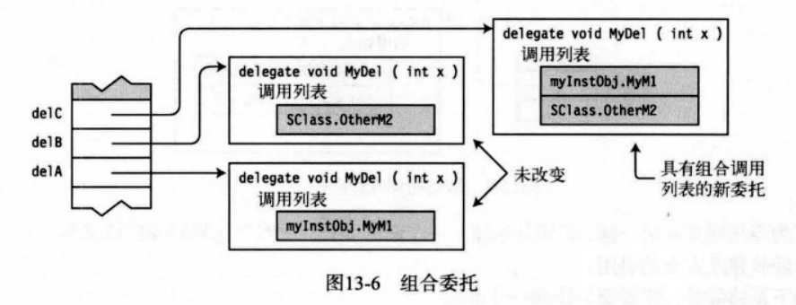

### 为委托添加方法

### 为委托移除方法

### 调用委托

### 委托的示例

### 调用带返回值的委托

### 调用带引用参数的委托

### 匿名方法

### Lambda表达式