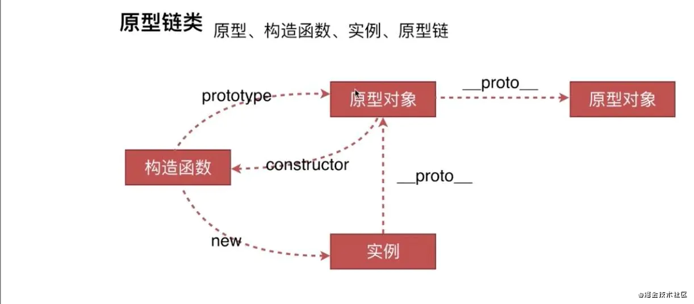
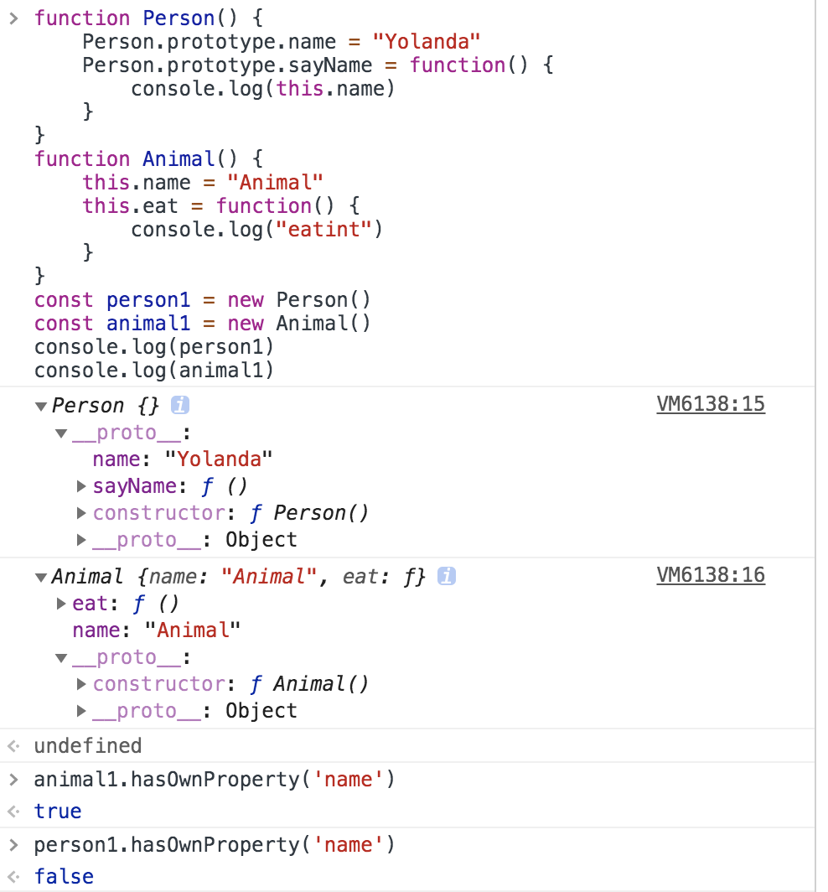
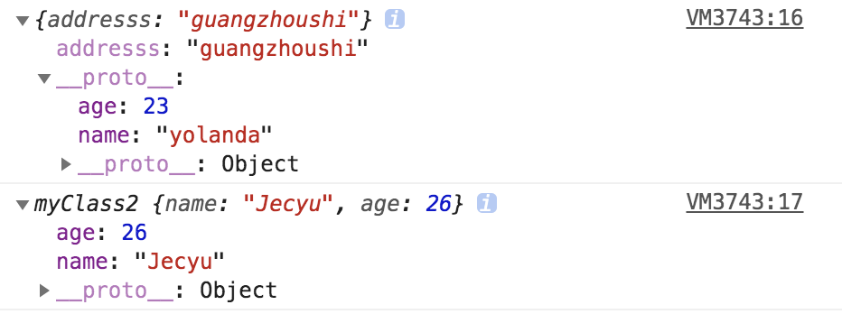
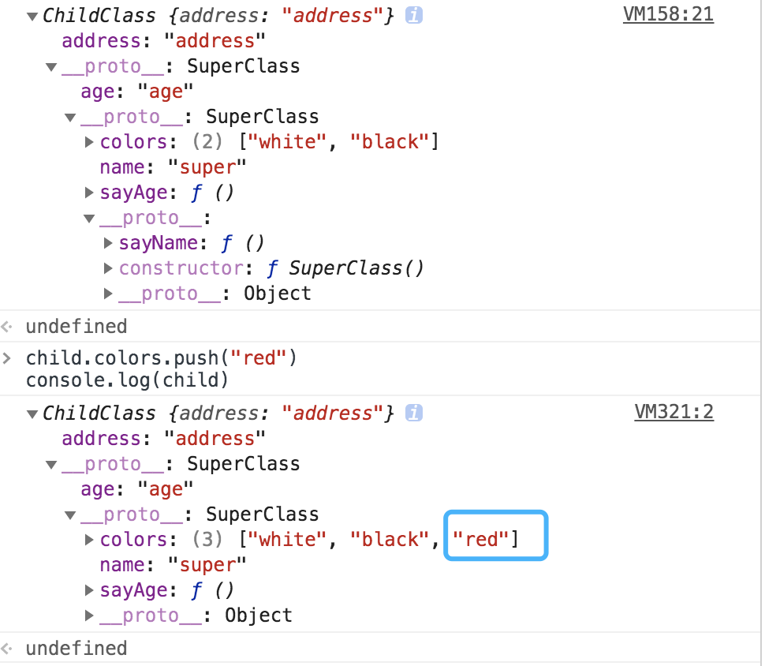
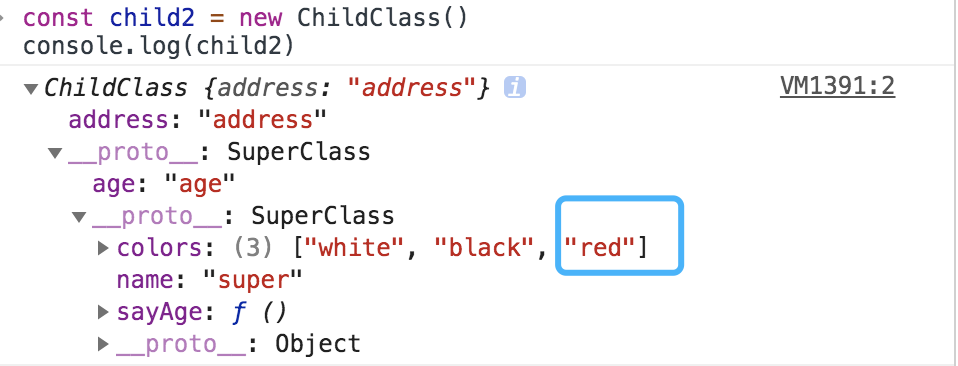
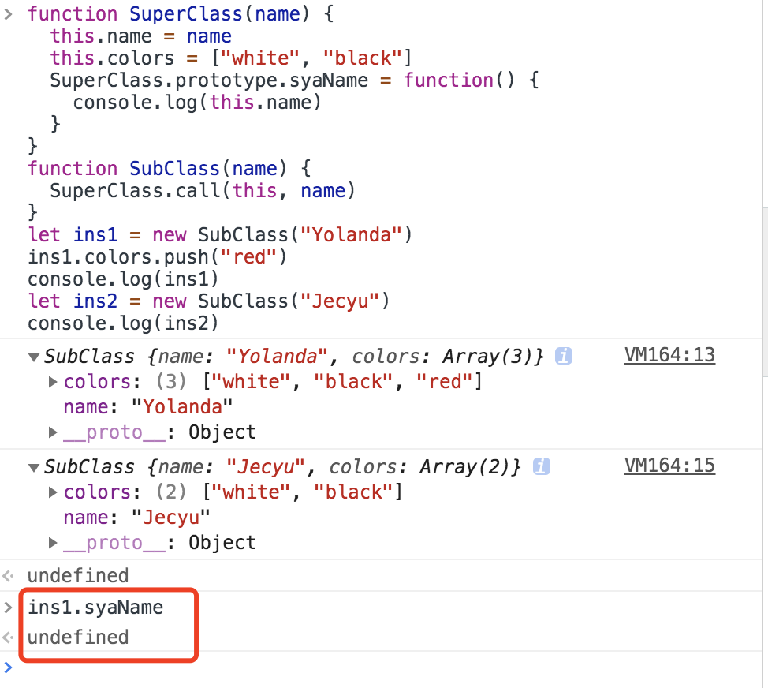
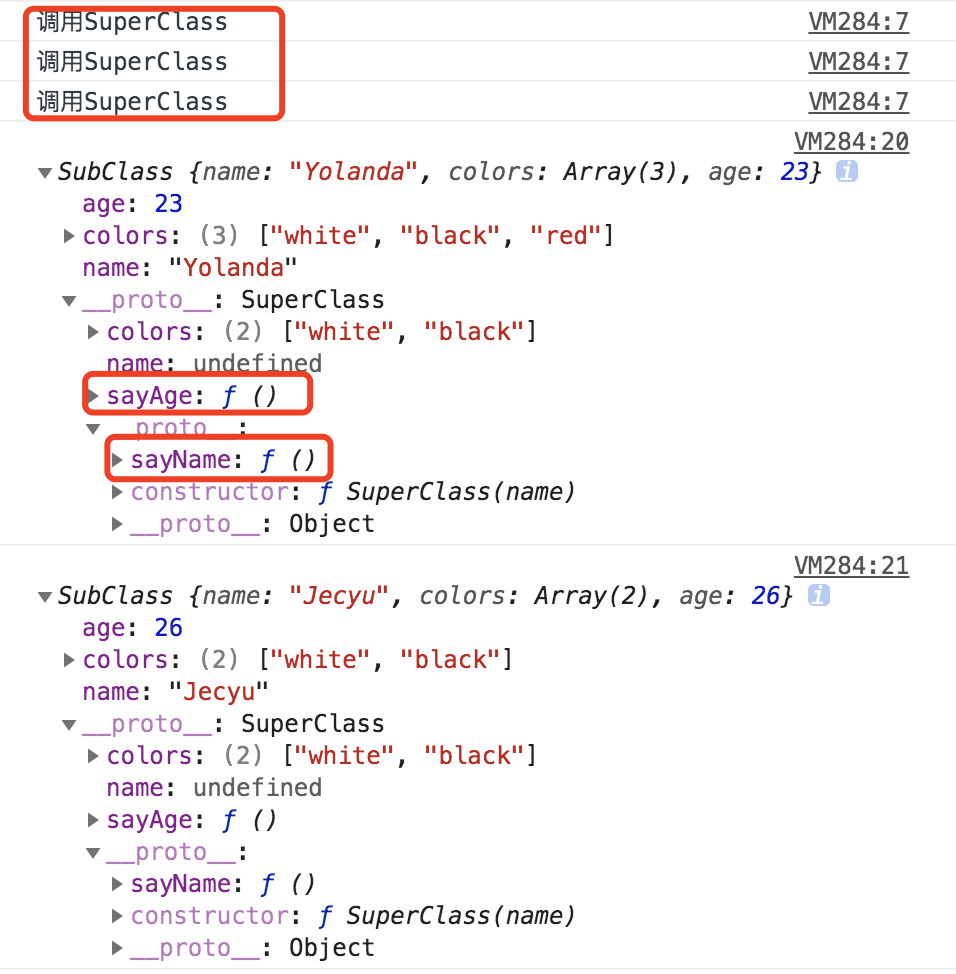
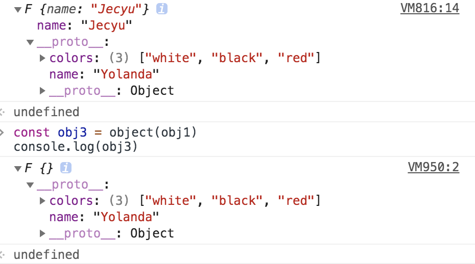
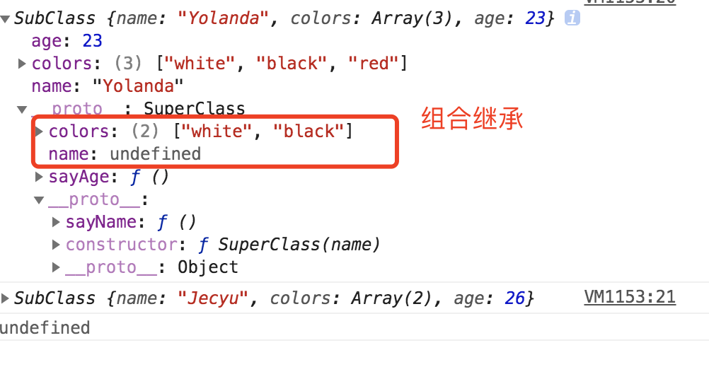
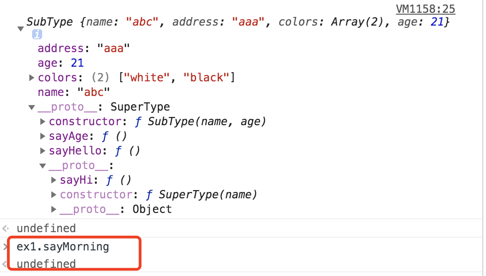

# JavaScript

## 拷贝 clone

Q：为什么要拷贝？如何拷贝？

A：拷贝对象是前端很常见的操作，用作备用或对比等场景。拷贝对象有两种：浅拷贝和深拷贝，什么时候用浅拷贝？什么时候用深拷贝呢？
- 浅拷贝 shallowClone
- 深拷贝 deepClone

### 浅拷贝 shallowClone

浅拷贝表现为：自己创建一个新的对象，如果源数据属性是*基本类型*，复制直接将基本类型的值给新对象；如果源数据属性是*引用类型*，复制的是内存的地址，如果其中一个对象修改了属性值，另一个对象的属性也会跟着变化

常见的几种浅拷贝方法：
- Object.assign
- 扩展运算符
- 自定义实现

#### 浅拷贝 —— Object.assign()

Object.assign() 是 ES6 中新增的一个方法，除了用于对象合并，还可以用于浅拷贝，将源对象（source）的所有可枚举属性，复制到目标对象（target）
```js
const target = {
  name: "Tom",
  age: 24,
  family: {
    father: "papa",
    mother: "mama"
  }
}
const source1 = { family: { sister: "sis" }}
const source2 = { age: 22 }
Object.assign(target, source1, source2)
console.log(target)
// {
//   name: "Tom",
//   age: 22,
//   family: {
//     father: "papa",
//     mother: "mama",
//     sister: "sis"
//   }
// }
```

*不可枚举属性、继承属性不能通过 Object.asign 拷贝*

```js
let targetObj = {a: "hahah"}
let sourceObj = Object.defineProperty({}, "invisible", {
  enumerable: false,
  value: "hello"
}) 
Object.assign(targetObj, sourceObj)
console.log(targetObj) // {a: "hahah"}
```


### 深拷贝 deepClone


## 原型链、实现继承

### 原型、构造函数、实例关系



构造函数会创建一个 `prototype` 属性，这个属性实际上就是构造函数创建实例时的*原型对象*，包含实例共享的属性和方法；实例的 `__proto__` 就是指向构造函数的 `prototype`
原型对象上的属性、方法，需要通过 .prototype.key 添加





- 通过 Object.create()
- 通过 constructor 构造函数

```js
const myClass1 = {
  name: "yolanda",
  age: 23
}
const properties = {
  addresss: {
    value: "guangzhoushi"
  }
}
function myClass2() {
  this.name = "Jecyu"
  this.age = 26
}
const p1 = Object.create(myClass1, properties)
const p2 = new myClass2()
console.log(p1)
console.log(p2)

// Object.create(proto，[propertiesObject]) 使用现有的对象来提供新创建的对象的__proto__ 

// propertiesObject该传入对象的自有可枚举属性(即其自身定义的属性，而不是其原型链上的枚举属性)将为新创建的对象添加指定的属性值和对应的属性描述符
```


### 继承

- 原型链继承

SubClass 的原型是 SuperClass 的实例，而 ChildClass 的原型是 SubClass 的实例
```js
function SuperClass() {
  this.name = "super"
  this.colors = ["white", "black"] 
  SuperClass.prototype.sayName = function() { 
    console.log(this.name)
  }
}
function SubClass() {
  this.age = "age" 
  SubClass.prototype.sayAge = function() {
    console.log(this.age) 
  }
}
function ChildClass() {
  this.address = "address"
}
SubClass.prototype = new SuperClass() // SubClass 的原型上 有一个 colors 属性
ChildClass.prototype = new SubClass()
const child = new ChildClass()
console.log(child)
```


**特点**：原型链继承可以同时继承原型的属性和方法，也能继承实例的属性和方法；

**缺点**：遇到原型上包含引用类型值时，修改单一实例会影响原型上的值：无法做到实例私有


- 盗用构造函数继承(经典继承)

关键代码：利用 call() 和 apply(), 以新创建的对象为上下文执行构造函数

```js
function SuperClass(name) {
  this.name = name
  this.colors = ["white", "black"]
  SuperClass.prototype.syaName = function() {
    console.log(this.name)
  }
}
function SubClass(name) {
  SuperClass.call(this, name)
}
let ins1 = new SubClass("Yolanda")
ins1.colors.push("red")
console.log(ins1)
let ins2 = new SubClass("Jecyu")
console.log(ins2)
```
**特点**：每个实例都有自己的属性，避免了引用类型的混用，可以在子类构造函数向父类构造函数传值

**缺点**：无法访问父类原型上定义的方法


- 组合继承(伪经典继承)

综合参考原型链继承和盗用构造函数

```js
function SuperClass(name) {
  this.name = name
  this.colors = ["white", "black"]
  SuperClass.prototype.sayName = function() {
    console.log(this.name)
  }
  console.log("调用SuperClass")
}
function SubClass(name, age) {
  SuperClass.call(this, name)
  this.age = age
  SubClass.prototype.sayAge = function() {
    console.log(this.age)
  }
}
SubClass.prototype = new SuperClass()
let ins1 = new SubClass("Yolanda", 23)
ins1.colors.push("red")
let ins2 = new SubClass("Jecyu", 26)
console.log(ins1)
console.log(ins2)
```


**特点**：实现了访问原型上定义的方法，又能让每个实例拥有自己的属性

**缺点**：存在效率问题，父类构造函数需要调用两次：一次在创建子类原型、一次在子类构造函数内

- 原型式继承

用一个函数去包装一个对象，函数对传入的对象做了一次 浅拷贝(类似ES6的Object.create())

```js
function object(obj) {
  function F() {
  }
  F.prototype = obj
  return new F()
}
const obj1 = {
  name: "Yolanda",
  colors: ["white", "black"]
}
const obj2 = object(obj1)
obj2.name = "Jecyu"
obj2.colors.push("red")
console.log(obj2)
```


**特点**：不需要端单独创建构造函数

**缺点**：属性中包含引用值类型会在相关对象间共存

- 寄生式继承

创建一个实现继承的函数，以某种方式增强对象，最后返回这个对象 

```js
const obj1 = {
  name: "Yolanda",
  colors: ["white", "black"]
}

function object(obj) {
  function F() {
  }
  F.prototype = obj

  return new F()
}

function createAnother(original) {
  let clone = object(original)
  clone.sayHi = function() {
    console.log("hi")
  }
}
const another1 = createAnother(obj1)
console.log(another1)
```

- 寄生组合式继承

```js
function inheritPrototype(subType, superType){ // 实现获取原型上的属性和方法的同时 不需要调用两次父类构造函数
    let prototype = Object.create(superType.prototype) // prototype 的原型是 superType.prototype
    prototype.constructor = subType
    console.log(prototype)
    subType.prototype = prototype // 给 subType 的 prototype 赋值 为 prototype
}
function SuperType(name) {
    this.name = name
    this.address = "aaa"
    this.colors = ["white", "black"]
    SuperType.prototype.sayHi = function() {
        console.log("hi")
    }
}
function SubType(name, age) {
    SuperType.call(this, name) // 调用一次父类构造函数 实现子类所创建的实例能够拥有自己的属性，避免引用类型混用
    this.age = age
    SubType.prototype.sayAge = function() {
        console.log(this.age)
    }
}

inheritPrototype(SubType, SuperType)
SubType.prototype.sayHello = function() {
        console.log("hello")
}
var ex1 = new SubType("abc", 21);
var ex2 = new SubType("def", 22);
ex1.colors.push("pink");
console.log(ex1)
console.log(ex2)
```

**特点**：

1、实现实例属性私有化，关键：`SuperType.call(this)`

2、实现访问父类原型上定义的属性和方法

关键：`subType.prototype = Object.create(superType.prototype)`

3、 减少调用父类函数的次数，避免了在 SuperType.prototype 上重复创建不必要的属性




**比较**：

方式一：`SubType.prototype = Object.create(SuperType.prototype);`

方式二：`SubType.prototype = new SuperType();`

原型链关系：
方式一：SubType.prototype => F 对象实例；F 对象实例.__proto__ => SuperType.prototype

方式二：SubType.prototype => SuperType 对象实例；SuperType 对象实例.__proto__ => SuperType.prototype

后者会继承 SuperType 构造函数中多余的属性和方法，最终两种方法 SubType.prototype 的原型都是指向 SuperType.prototyp

**对象的原型，同时也是另一个对象的实例**

**注意**：父类上的静态方法不会被子类的实例继承
```js
function SuperType(name) {
    this.name = name
    this.address = "aaa"
    this.colors = ["white", "black"]
    SuperType.prototype.sayHi = function() { // 父类原型上的方法
        console.log("hi")
    }
  SuperType.sayMorning = function() { // 父类上的静态方法
    console.log("morning")
  }
}
function SubType(name, age) {
    SuperType.call(this, name)
    this.age = age
    SubType.prototype.sayAge = function() {
        console.log(this.age)
    }
}

inheritPrototype(SubType, SuperType)
SubType.prototype.sayHello = function() {
        console.log("hello")
}
var ex1 = new SubType("abc", 21);
console.log(ex1)

```



## 作用域


## Promise