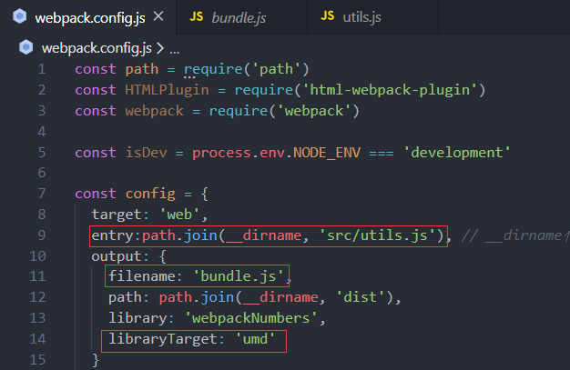
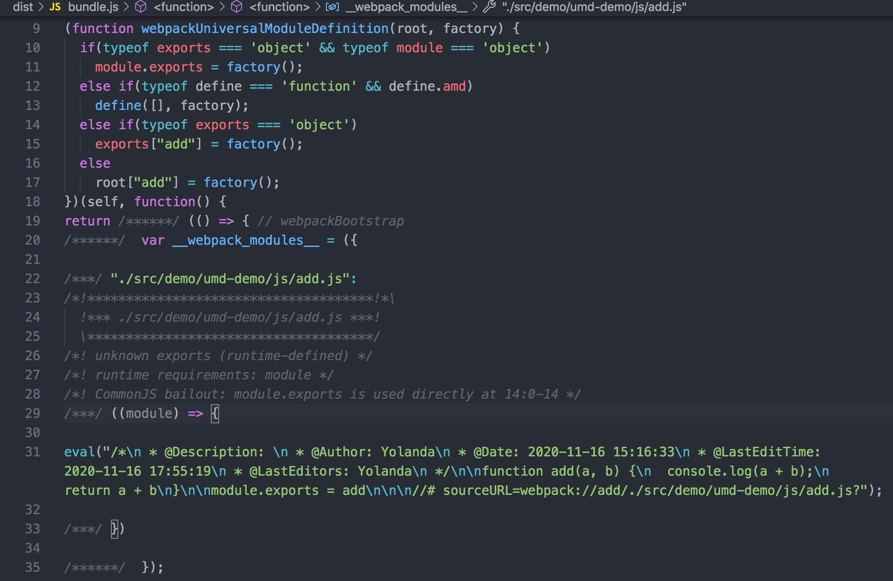

# 模块化

## 什么是模块化？

- 将一个复杂的程序依据一定的规则(规范)封装成几个块(文件), 并进行组合在一起
- 块的内部数据与实现是私有的, 只是向外部暴露一些接口(方法)与外部其它模块通信

不仅前端有模块化，后端也有模块化

在开发中较为流行的JavaScript模块规范有：CommonJS、AMD、CMD、UMD和ES6

**为什么服务端需要模块化？**

因为服务端需要与操作系统的其他应用程序互动，如果没有模块化是很难编程的

**为什么客户端需要模块化？**

在 JavaScript 发展初期，前端的大部分工作只是实现简单的交互逻辑，随着前端技术的发展，很多只在服务端实现的功能迁移到客户端实现，而嵌入网页的JS代码越来越庞大、复杂，模块化编程成为了一个迫切的需求

（在没有模块化编程时，我们会遇到以下几点问题：)
### 没有模块化的编程
  - 程序的变量和方法不容易维护，容易污染全局变量
  - 加载资源的方式主要是通过 **script** 标签从上到下，页面白屏时间过长，客户体验感较差
  - 依赖的环境主观逻辑偏重，代码一旦多了就比较复杂
  - 大型项目资源难以维护，在多人合作的情况下，资源的引入容易让人奔溃

刚开始时，我们是这样为页面引入资源：
```js
<script src="../js/lib/lodash.min.js"></script>
<script src="../js/lib/jquery.min.js">
<script src="https://cdn.jsdelivr.net/npm/vue"></script>
<script src="https://unpkg.com/axios/dist/axios.min.js"></script>
```
script 标签**从上到下**引入了我们想要的资源，这其中的顺序是非常重要的，资源的加载先后决定了我们的代码是否能够跑下去。当然在前面我们了解到 script 新增有 defer 和 async 属性，但这里暂时不讨论这两者的作用。可以看出，当我们项目越大，依赖越多时，就会有更多的 script 标签，相应也有越多的资源请求。这时全局污染的可能性会更大，如何能避免上述的几个问题，形成独立的作用域，各程序间互不干扰呢？

### 模块化的进展

**直接定义依赖 模式:** 直接将变量定义在全局

```js
// greeting.js
var helloInLang = {
  en: "Hello World!",
  es: "Hola mundo!",
  cn: "你好 世界!"
}

function writeHello(lang) {
  dounment.write(helloInLang[lang])
}

// other.js
function writeHello() {
  dounment.write("another same function broken")
}

// index.html
<!DOCTYPE html>
<html>
  <head>
    <script src="./greeting.hjs"></script>
    <script src="./other.js"></script>
  </head>
  <body onLoad="writeHello('cn')">
  </body>
</html>
```
（这种就是典型的全局变量被污染的现象，于是有人提出*命名空间模式*，用于解决遍地全局变量）

**命名空间 模式:** 将需要定义的部分归属到一个对象的属性上

```js
// greeting.js
var app = {}
app.helloInLang = {
  en: "Hello World!",
  es: "Hola mundo!",
  cn: "你好 世界!"
}
app.writeHello = function(lang) {
  dounment.write(helloInLang[lang])
}

// other.js
function writeHello() {
  dounment.write("another same function broken")
}
```
(实际上，这种模式本质还是操作全局对象，在其他模块上也能被修改，安全性很低。所以出现了*闭包模块化模式*，解决私有变量的问题)

**IIFE 模式**

  立即执行函数(immediately-invoked function expression),简称 IIFE，它是一个 JavaScript 函数，可以在函数内部定义方法及私有属性，相当于一个封闭的作用域

```js
// greeting.js
var greeting = (function() {
  var module = {};
  var helloInLang = {
    en: "Hello World!",
    es: "Hola mundo!",
    cn: "你好 世界!"
  }
  module.getHello = function(lang) {
    return helloInLang(lang)
  }
  module.writeHello = function(lang) {
    alert(module.getHello(lang))
  }
  return module
})()
```

IIFE 可以形成一个独立的作用域，其中声明的变量尽在该作用域下，从而达到实现私有变量的目的，如上述例子中的 `helloInLang` 在该 IIFE 外是不能直接访问和操作的，但可以通过暴露一些方法来访问或操作，如 `getHello`和`writeHello`。虽然 IIFE 解决了依赖关系的问题，但是在使用上还是比较混乱，没有解决模块管理的问题，随着页面中使用的模块数量越来越多，开发者很难维护好他们之间的依赖关系。
以上几种方式都是通过约定的方式实现模块化，在不同的开发者中还会有差别，为了统一开发过程和不同项目之间的差异，我们需要一个标准去规范模块化的实现

## 模块化规范有哪几种？

### CommonJS

**概述** 是一种为JS表现指定的规范，更适用于服务端模块规范，我们熟悉的 Node.js 就是采用了这个规范。核心思想是：每个文件就是一个模块，有自己的作用域。在一个文件里面定义的变量、函数、类都是私有的，对其他文件不可见。通过exports或module.exports来导出暴露接口，通过reuqire 同步加载要依赖的模块

**基本语法**
- 定义模块 
  ```
  module.exports = value 
  或 exports.xxx = value
  ```
- 引入模块
  ```
  require(xxx) 
  // 如果是第三方模块，xxx为模块名
  // 如果是自定义模块，xxx为模块文件路径
  ```

*require命令*加载模块文件，基本功能是读入并执行一个JavaScript文件，返回该模块的exports对象，如果没有找到指定模块会报错

**特点**
- 适用于服务端编程,如Node.js
- 所有代码都运行在模块作用域，不会污染全局作用域
- 模块可以多次加载，但只会在第一次加载时运行一次，然后运行结果就被缓存了，以后再加载就直接读取缓存结果；要想让模块再次运行，必须清除缓存
- 模块加载的顺序，按照其在代码中出现的顺序
- 模块输出的是一个*值的拷贝*

**实现**：

eg:

```js
// math.js
const counter = 0;
const obj = {
  name: 'Yolanda',
  age: 22
}
const add = function (num) {
  obj.age += num
}
module.exports = {
  counter,
  obj,
  add
}

// main.js
const counter = require('./math').counter
const obj = require('./math').obj
console.log(obj) // name: Yolanda,age: 22
console.log(counter) // 0
add(2) // add
console.log(counter) // 0
console.log(obj) // name: Yolanda,age: 24

```

虽然以上代码实现了模块化，但应用于浏览器环境，是有局限性的：代码`console.log(obj)`必须在第十四行代码`const obj = require('./math').obj`加载完成后才能执行，如果加载时间很长，就会导致浏览器处于'假死'状态.因此浏览器模块不能采用以上的'同步加载'方式，只能采用'异步加载'模块，这就是AMD规范诞生的背景

### AMD

**概述**: AMD(Asyncchromous Module Definition),意思是异步模块定义，它采用异步方式加载模块，模块的加载不影响后面的语句执行，所有依赖这个模块的语句，都定义在一个回调函数中，等加载完成后这个回调函数才调用


**基本语法**
- 定义模块
  ```
  define(['m1', 'm2'], function(m1, m2) { return 模块})
  ```
- 加载模块
  ```
  require(['m1', 'm2'], function(m1, m2) { // 使用m1、m2})
  ```

**特点**
- 适用于浏览器环境
- 定义清晰，不会污染全局变量，能清楚地显式依赖关系
- 允许异步加载模块，也可以根据需要动态加载模块
- 提前加载,推崇依赖前置

**实现**：
eg: 目前有一个流行库 [require.js](https://requirejs.org/) 主要用于客户端的模块管理

文件结构目录：
```
|-src
  |-libs
    |-require.js
  |-demo
    |-demo
      |-demo3
        |-add.js
        |-alter.js
        |-sub.js
        |-thirdModule.js
  |-main.js
  |-index.html
```

*依赖模块*
```js
// add.js
define(function() {
  console.log('加载了add模块')
  const add = (a, b) => {
    return a + b
  }
  return add
})

// alter.js文件
define(['thirdModule'], function(thirdModule) {
  console.log('加载了alter模块')
  let name = 'alter模块中引入了thirdModule'
  const alter = {}
  alter.showMsg = () => {
    alert(`${thirdModule.getMsg()},${name}`)
  }
  return alter
})

// thirdModule.js
define(function() {
  let msg = "AMD模式加载['add', 'alter', 'sub']"
  console.log('加载了third模块')
  const getMsg = () => {
    return msg
  }
  return { getMsg }
})

// sub.js
define(function() {
  console.log('加载了sub模块')
  const sub = (a, b) => {
    return a - b
  }
  return sub
})
```
*主模块*

```
// index.html文件
<!DOCTYPE html>
<html>
  <head>
    <title>Modular Demo</title>
  </head>
  <body>
    <!-- 引入require.js并指定js主文件的入口 -->
    <script data-main="./main.js" src="./libs/require.js"></script>
    <!-- data-main指定主模块文件 -->
  </body>
</html>
```
```js
// main.js文件
require.config({
    baseUrl: 'demo/demo3',
    paths: {
      add: "add",
      alter: "alter",
      sub: "sub"
    }
  })
  require(['add', 'alter', 'sub'], function(add, alter, sub) {
    console.log(add(4, 5))
    alter.showMsg()
    console.log(sub(10, 4));
  })
// 打印结果
// 加载了add模块
// 加载了sub模块
// 加载了third模块
// 加载了alter模块
// 9
// 6
```
**小结**：说明了AMD一个特性是提前加载,推崇依赖前置

`require.config()`方法可以自定义模块加载行为，就写在主模块main.js的头部
```js
  require.config({
    paths: { // 指定各个模块的加载路径 假设这些文件都与main.js在同一个目录(js子目录)
      'jQuery': 'jquery.min',
      'underscore': 'underscore.min',
      'backbone': 'backbone.min'
    }
  })
   //  假设这些文件都与main.js不在同一个目录
  require.config({
    baseUrl: 'js/lib',
    paths: {
      'jQuery': 'jquery.min', // 或者改成 'lib/jquery.min' 去掉baseUrl
      'underscore': 'underscore.min',
      'backbone': 'backbone.min'
    }
  })

```

**注意**：如果需要加载不符合规范的模块，可以采用`require.config()`进行改造，利用`require.config()`中的`shim`属性定义一些特征：
eg:
```js
  require.config({
    shim: {
      'underscore': {
        export: '_'
      },
      'backbone': {
        deps: ['underscore', 'jquery'],   // 表明这个模块的依赖性
        export: 'Backbone'                // 定义这个模块外部调用时的名称
      }
    }
  })
```

### CMD

**概述**: CMD规范专门用于浏览器，模块是异步加载，并且是在使用时才会执行加载。**CMD** 整合了 ConmmonJS 和 AMD 规范的特点。[SeaJS](https://github.com/seajs/seajs/edit/master/dist/sea.js) 是一个适用于 Web 浏览器端的模块加载器，使用 SeaJS，所有的模块都遵循 CMD 规范，可以更好地组织 JavaScript 代码

**基本语法**
- 定义暴露模块
  ```js
  define(function(require, exports, module) {
      // 有依赖时 同步引入
      var module2 = require('./module2')
      // 有依赖时 异步引入
      reuqire.async('./module3', function(m3) {
        // ...
      })
      exports.xxx = value // 用于在模块内部对外提供接口
    })
  ```
- 引入模块
  ```js
  define(function(require) {
      var m1 = require('./module1')
      m1.show()
      var m4 = require('./module4')
      m4.show()
    })
  ```

**实现**
  eg: 以Sea.js为例

  文件结构目录：
  ```
|-src
  |-libs
    |-require.js
  |-demo
    |-demo
      |-demo3
        |-add.js
        |-alter.js
        |-sub.js
        |-thirdModule.js
  |-main.js
  |-index.html
  ```

*依赖模块*

  ```js
  // module1.js
  define((require, exports, module) => {
    console.log('加载了module1')
    const data = 'hello this is modulue1'
    const show = () => {
      console.log(`module1 show() ${data}`)
    }
    exports.show = show
  })

  // module2.js
  define((require, exports, module) => {
    console.log('加载了module2')
    module.exports = {
      msg: 'I will back'
    }
  })

  // module3.js
  define((require, exports, module) => {
    console.log('加载了module3')
    const API_KEY = 'abc123'
    exports.API_KEY = API_KEY
  })

  // module4.js
  define((require, exports, module) => {
    console.log('加载了module4')
    // 同步引入依赖
    const module2 = require('./module2')
    const show = () => {
      console.log(`module4 show()${module2.msg}`)
    }
    exports.show = show
    // 或者 module.exports = { show }
    require.async('./module3', (m3) => {
      console.log(`异步引入依赖${m3.API_KEY}`)
    })
  })
  ```

*主模块*

```html
  // index.html文件
  <!DOCTYPE html>
  <html>
    <head>
      <title>Modular Demo</title>
    </head>
    <body>
      <script type="text/javascript" src="./libs/sea.js"></script>
      <script type="text/javascript">
        seajs.use('./main.js')
      </script> 
    </body>
  </html>
```

```js
  // main.js 
  define((require, exports, module) => {
    const m1 = require('./module1')
    m1.show()
    const m4 = require('./module4')
    m4.show()
  })
  // 打印结果
  // 加载了module1
  // module1 show() hello this is module1
  // 加载了module4
  // 加载了module2
  // module4 show() hello this is module2
  // 加载了module3
  // 异步引入依赖 hello this is module3
```

**require.async(id, callback)** 方法用于模块内部异步加载模块，并在加载完成后执行指定回调，callback参数可选.一般用来加载可延迟异步加载的模块

### UMD

**概述** UMD(Universal Module Definition) 通用模块规范，是整和了AMD和CommonJS的规范，通过判断是支持node.js的模块关键字**exports** 还是支持AMD的模块的关键字**define**是否存在来判断使用何种规范(注意，不支持 CMD 规范)

**基础语法**
  ```js
(function(root, factory) {
    if (typeof module === 'object' && typeof module.exports === 'object') {
        console.log('是commonjs模块规范，nodejs环境')
        module.exports = factory();
    } else if (typeof define === 'function' && define.amd) {
        console.log('是AMD模块规范，如require.js')
        define(factory())
    // } else if (typeof define === 'function' && define.cmd) {
    //     console.log('是CMD模块规范，如sea.js')
    //     define(function(require, exports, module) {
    //         module.exports = factory()
    //     })
    } else {
        console.log('没有模块环境，直接挂载在全局对象上')
        root.umdModule = factory();
    }
}(this, function(a, b) {
    const add = (a, b) => {
        console.log(a + b)
        return a + b
    }
    return {
        add
    }
}))
  ```

**实现**
eg: 通过webpack打包一个自定义模块


**打包后的文件**


如何使用这个打包后的bundle.js文件呢？很明显，UMD支持AMD和CommonJS规范，以下几种方式都可引用 bundle.js

**umd-use-by-global** 没有模块环境，直接挂载在全局对象上
```html
<!DOCTYPE html>
<html lang="en">
  <script type="text/javascript" src="../../../dist/bundle.js"></script>
  <script>
    add(4, 9)
  </script>
</html>
```
**umd-use-by-require** RequireJS 加载 UMD 模块
```js
// 使用 requirejs 加载 bundle.js
require.config({
    baseUrl: '../../../dist',
    paths: {
      add: "bundle"
    }
  })
  require(['add'], function(add) {
    add(1, 4)
  })
```
```html
<!DOCTYPE html>
<html lang="en">
  <script data-main="./js/use-by-require.js" src="../../libs/require.js"></script>
</html>
```
**umd-use-in-node** node 环境加载 UMD
```js
const add = reqire('../../../dist/bundle.js')
add(1, 4)

// 命令行敲 node ./src/main.js
```
**注意**需要在webpack.config.js中配置：
```js
output: {
  globalObject: 'typeof self !== \'undefined\' ? self : this'
}
```

**umd-use-by-sea**
如果想要 umd 模块被 SeaJS 加载，需要在 bundle.js 做以下处理：
```js
// (function(root, factory) {
//     if (typeof module === 'object' && typeof module.exports === 'object') {
//         console.log('是commonjs模块规范，nodejs环境')
//         module.exports = factory();
//     } else if (typeof define === 'function' && define.amd) {
//         console.log('是AMD模块规范，如require.js')
//         define(factory())
    } else if (typeof define === 'function' && define.cmd) {
        console.log('是CMD模块规范，如sea.js')
        define(function(require, exports, module) {
            module.exports = factory()
        })
//     } else {
//         console.log('没有模块环境，直接挂载在全局对象上')
//         root.umdModule = factory();
//     }
// }(this, function(a, b) {
//     const add = (a, b) => {
//         console.log(a + b)
//         return a + b
//     }
//     return {
//         add
//     }
// }))
```

不建议在 html 中使用`import` 引入umd 模块呢？即便 es6 提供了`script`标签属性`type="module"`支持es6语法引入模块的API

```html
// index.html文件
<script type="module">
  import { add } from '../dist/bundle.js'
  console.log(add(4,5)) // 报错
</script>
```
**报错**目标文件找不到提供的add


**原因** 打包后的 bundle 文件只支持 AMD 或 CommonJS 规范,所以并没有提供 ES6 规范对应所需的**import/exports**语法,如果在一个 vue-cli 搭建的项目中引入这个 bundle 文件,是可以正常使用里面的方法,因为项目经过了**babel**处理, import 编译成 require ,就能识别bundle.js提供的 exports


总结：对于我们自己封装的库，使用 umd 规范打包是比较通用的，eye-map 组件库就是利用 rollup 构建成 umd 模块提供使用。（rollup是另一种常用的构建工具）

### ES6

**概述** ES6在语言标准层面上实现了模块功能,方式简单明了,依赖在编译时完成加载,取代了 CommonJS 和 AMD  规范,成为浏览器和服务端通用的模块解决方案

**基础语法**
  - 定义模块
  ```js
    // add-es6.js
    const add = (a, b) => {
      return a + b
    }
    export { basicNum, add }
  ```
  - 引入模块
  ```js
    import { basicNum, add } from './main'
    const test = ele => {
      ele.textContent = add(99 + basicMum)
      console.log(ele.textContent)
    }
    test()
  ```
  **或者：**
  ```html
<!DOCTYPE html>
<html lang="en">
<script type="module">
import add from './js/add-es6.js'
add(1, 3)
document.querySelector('#content').innerText = '在 html 中引用 ES6 模块'
document.querySelector('#add').innerText = `add 1 to 3, sum is ${add(1, 3)}`
</script>
  ```
  注意：当模块默认输出时，即采用 `export default`时，引入模块的名称可以为任意,且不需要花括号

  eg:
  ```js
  // export-default.js
  export default const A = () => {
    console.log('foo')
  }
  // other.js
  import B from './export-defaule'
  B()
  ```

**ES6模块**与**CommonJS**比较：
- reuqire 使用于CommonJS规范, import 使用于ES6规范
- **CommonJS**
  - CommonJS输出的是**值的拷贝**
  - 对于基本数据类型,调用模块内部方法对值进行修改,不会影响已导出模块的值,原模块的值也不会修改
  - 对于复杂数据类型,因为浅拷贝,两个对象指向同一个引用,如果对值进行修改,已导出,原模块的值都会修改
  - CommonJS 模块是运行时加载
  - 当使用require命令加载某个模块时就会运行整个模块的代码,当重复执行加载相同模块时,不会再执行加载模块而是取缓存中的值,即只会在第一次加载运行一次,以后都会返回第一次加载的结果,除非手动清除缓存
  - 可以在任何位置，甚至条件的引入模块
- **ES6**
  - ES6输出的是**值的动态引用**
  - 对于基本数据类型,调用模块内部方法对值进行修改,会影响模块已导出的值,原模块的值也会修改
  - 对于复杂数据类型,如果对模块的值进行更改,模块已输出,原模块的值都会更改
  - ES6模块是编译时输出接口
  - 由于ES模块是静态的，因此import语句只能位于模块的顶端，且不能条件的引入，为什么强制要求在模块顶部声明引入模块呢？因为这样webpack等工具可以快速获取代码的依赖关系树，可以查看未使用的代码并将其从打包工具中删除。

  ```js
  // lib.js
  export let counter = 0
  export let obj = {
    name: 'Yolanda',
    age: 22
  }
  export const incCounter = (n) => {
    counter++
    obj.age += n
  }
  // main.js
  import { counter, incCounter, obj } from './lib'
  console.log(counter) // 0
  console.log(obj) // name: 'Yolanda', age: 22
  incCounter(2)
  console.log(counter) // 1 如果是CommonJS这里还是0
  console.log(obj) // name: 'Yolanda', age: 24
  ```

## 模块化是如何实现的？

Node是如何加载common模块？

```js
//exports内存中指向的就是module.exports指向的那块空间
//require一个方法
//Module模块类
//__filename该文件绝对路径
//__dirname该文件父文件夹的绝对路径
(function(exports,require,Module,__filename,__dirname){
  module.exports = exports = this = {}
  //文件中的所有代码
  

  //不能改变exports指向，因为返回的是module.exports，所以是个{}
  return module.exports
})
```
当我们require的时候其实就相当于执行了这么一个闭包，然后返回的就是我们的module.exports

**require** 方法是怎么处理模块？
- 每一个模块都会带有一个 require 方法
- 动态加载（v8执行到这一步才去加载此模块）
- 不同模块的类别，对应不同的加载方式，一般有三种常用后缀
  - 后缀为 .js 的 JavaScript 脚本文件，需要先读入内存再运行 (前端学习)
  - 后缀为 .json 的 Json 文件，通过 fs 读入内存后转化成 JSON 对象
  - 后缀为 .node  的经过编译后的二进制 C/C++ 扩展模块文件，可以直接使用


## 总结
- CommonJS规范主要用于*服务端*编程，加载模块是*同步*的，这并不适合在浏览器环境，因为同步意味着阻塞加载，浏览器资源是异步的，因此有了AMD、CMD
- AMD规范在*浏览器环境*中*异步*加载模块，推崇依赖前置，而且可以并行加载多个模块。但是AMD规范开发成本较高，代码阅读和书写比较困难，模块定义方式语义不顺畅
- CMD规范与AMD规范很相似，都用于*浏览器*编程，依赖就近，延迟执行，可以很容易在*Node.js*中运行，不过它依赖SPM打包，模块加载逻辑偏重
- ES6在语言标准层面上，实现了模块功能，代码简单清晰，成为浏览器和服务端通用的模块解决方案
- UMD通过判断支持node.js的模块exports、支持AMD的模块define是否存在来判断使用何种规范,是目前比较通用的规范之一

### 补充
|   包管理工具  |    模块化构建工具                      |    模块化规范    |
|   ---------   |   -------------                       |   ----------    |
|     npm       |       webpack                         |     ES6         |
|     bower     |   requireJS/seaJS/browserity(正在衰落)| AMD/CMD/CommonJS|

- **包管理工具**:安装,卸载,更新,查看,搜索,发布包等功能如npm
- **模块化构建工具**:用来组织前端模块的构建工具(加载器)如webpack,requireJS,seaJS等,通过使用模块化规范(AMD/CMD/CommonJS/ES6)的语法实现按需加载
- **模块化规范**:AMD/CMD/CommonJS/ES6等,规范了如何组织代码,经过构建工具打包后编译成浏览器能识别的文件


理解ES6模块的含义:

模块提供了更好的方式来组织变量和函数,与函数作用域不同的是,模块内部的变量实现了在其他模块内共享,可以指定哪些变量,类或函数可以共享.在其他模块中共享,被称为 export.这就出现了模块间的依赖,当移除一个模块时可以准确知道哪些模块会报错.一旦有了模块间导出和引用变量的能力,就能够利用包管理工具,将代码打成小包,再组合应用

ES模块化的工作机制:

模块化开发会将依赖构建为树形结构.通过import语句通知浏览器或者Node去加载相关的代码.这些依赖树会有一个根节点作为入口文件,从入口文件可以找到依赖的其他代码

### 参考资料
[https://tylermcginnis.com/javascript-modules-iifes-commonjs-esmodules/](https://tylermcginnis.com/javascript-modules-iifes-commonjs-esmodules/)