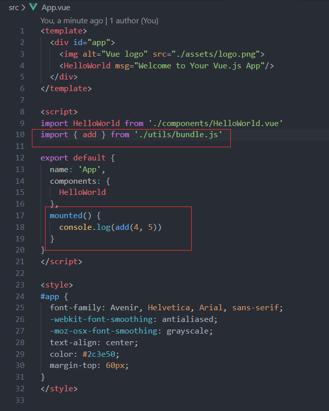

## 模块化

**什么是模块化？**

将一个复杂的程序依据一定的规范封装成几个块（文件），并组合在一起；块的内部数据与实现是私有的，只是向外部暴露一些接口（方法）与外部其他模块通信

通行的JavaScript模块规范有两种：CommonJS 和 AMD

**为什么服务端需要模块化？**

因为服务端需要与操作系统和其他应用程序互动，如果没有模块化是没办法编程

**为什么客户端需要模块化？**

嵌入网页的JS代码越来越庞大、复杂，模块化编程成为一个迫切的需求

### CommonJS

**概述** 是一种为JS表现指定的规范，更适用于服务端模块规范，Node.js就是采用了这个规范。核心思想是：每个文件就是一个模块，有自己的作用域。在一个文件里面定义的变量、函数、类都是私有的，对其他文件不可见。通过exports或module.exports来导出暴露接口，通过reuqire 同步加载要依赖的模块

**基本语法**
- 定义模块 
  ```
  module.exports = value 
  或 exports.xxx = value
  ```
- 引入模块
  ```
  require(xxx) 
  // 如果是第三方模块，xxx为模块名
  // 如果是自定义模块，xxx为模块文件路径
  ```

*require命令*加载模块文件，基本功能是读入并执行一个JavaScript文件，返回该模块的exports对象，如果没有找到指定模块会报错

**特点**
- 适用于服务端编程,如Node.js
- 所有代码都运行在模块作用域，不会污染全局作用域
- 模块可以多次加载，但只会在第一次加载时运行一次，然后运行结果就被缓存了，以后再加载就直接读取缓存结果；要想让模块再次运行，必须清除缓存
- 模块加载的顺序，按照其在代码中出现的顺序
- 模块输出的是一个值的拷贝

**实现**：

eg:

```js
// math.js
const counter = 0;
const obj = {
  name: 'Yolanda',
  age: 22
}

module.exports = {
  counter,
  obj
}

// main.js
const counter = require('./math').counter
const obj = require('./math').obj
console.log(obj) // name: Yolanda,age: 22
console.log(counter) // 0
add(2) // add
console.log(counter) // 0
console.log(obj) // name: Yolanda,age: 24

```

虽然以上代码实现了模块化，但应用于浏览器环境，是有局限性的：代码`console.log(obj)`必须在第十四行代码`const obj = require('./math').obj`加载完成后才能执行，如果加载时间很长，就会导致浏览器处于'假死'状态.因此浏览器模块不能采用以上的'同步加载'方式，只能采用'异步加载'模块，这就是AMD规范诞生的背景

### AMD

**概述**: AMD(Asyncchromous Module Definition),意思是异步模块定义，它采用异步方式加载模块，模块的加载不影响后面的语句执行，所有依赖这个模块的语句，都定义在一个回调函数中，等加载完成后这个回调函数才调用


**基本语法**
- 定义模块
  ```
  define(['m1', 'm2'], function(m1, m2) { return 模块})
  ```
- 加载模块
  ```
  require(['m1', 'm2'], function(m1, m2) { // 使用m1、m2})
  ```

**特点**
- 适用于浏览器环境
- 定义清晰，不会污染全局变量，能清楚地显式依赖关系
- 允许异步加载模块，也可以根据需要动态加载模块
- 提前加载,推崇依赖前置

**实现**：
eg: 以一个流行库 require.js 主要用于客户端的模块管理

文件结构目录：
```
|-js
  |-libs
    |-require.js
  |-modules
    |-add.js
    |-alerter.js
    |-dataService.js
  |-main.js
|-index.html
```

*依赖模块*
```js
// add.js
define(function() {
  console.log('加载了add模块')
  const add = (a, b) => {
    return a + b
  }
  return { add }
})
// dataService.js文件
define(function() {
  let msg = 'www.baidu.com'
  console.log('加载了dataService模块')
  const getMsg = () => {
    return msg.toUpperCase()
  }
  return { getMsg }
})

// aletr.js文件
define(['dataService'], function(dataService) {
  console.log('加载了alter模块')
  let name = 'Tom'
  const showMsg = () => {
    alert(`${dataService.getMsg()},${name}`)
  }
})
```
*主模块*
```js
  // main.js文件
  (function() {
    require.config({
      baseUrl: 'js/',
      paths: {
        add: './add.js',
        alerter: './modules/alerter',
        dataService: './modules/dataService'
      }
    })
    reuqire(['add', 'alerter'], function(add, alerter) {
      console.log(add(4, 5))
      alerter.showMsg()
    })
  })()
  // 打印结果
  // 加载了add模块
  // 加载了dataService模块
  // 加载了alter模块
  // 9
  // WWW.BAIDU.COM Tom
  // 说明了AMD一个特性是提前加载,推崇依赖前置
```

*index.html*
```
// index.html文件
<!DOCTYPE html>
<html>
  <head>
    <title>Modular Demo</title>
  </head>
  <body>
    <!-- 引入require.js并指定js主文件的入口 -->
    <script data-main="js/main" src="js/libs/require.js"></script>
    <!-- data-main指定主模块文件 -->
  </body>
</html>
```

`require.config()`方法可以自定义模块加载行为，就写在主模块main.js的头部
```js
  require.config({
    paths: { // 指定各个模块的加载路径 假设这些文件都与main.js在同一个目录(js子目录)
      'jQuery': 'jquery.min',
      'underscore': 'underscore.min',
      'backbone': 'backbone.min'
    }
  })
   //  假设这些文件都与main.js不在同一个目录
  require.config({
    baseUrl: 'js/lib',
    paths: {
      'jQuery': 'jquery.min', // 或者改成 'lib/jquery.min' 去掉baseUrl
      'underscore': 'underscore.min',
      'backbone': 'backbone.min'
    }
  })

```

**注意**：如果需要加载不符合规范的模块，可以采用`require.config()`进行改造，利用`require.config()`中的`shim`属性定义一些特征：
eg:
```js
  require.config({
    shim: {
      'underscore': {
        export: '_'
      },
      'backbone': {
        deps: ['underscore', 'jquery'],   // 表明这个模块的依赖性
        export: 'Backbone'                // 定义这个模块外部调用时的名称
      }
    }
  })
```

### CMD

**概述**: CMD规范专门用于浏览器，模块地加载是异步地，模块使用时才会加载执行。CMD**整合**了ConmmonJS和AMD规范地特点。在Sea.js中，所有JavaScript模块都遵循CMD规范

**基本语法**
- 定义暴露模块
  ```js
  define(function(require, exports, module) {
      // 有依赖时 同步引入
      var module2 = require('./module2')
      // 有依赖时 异步引入
      reuqire.async('./module3', function(m3) {
        // ...
      })
      exports.xxx = value // 暴露模块
    })
  ```
- 引入模块
  ```js
  define(function(require) {
      var m1 = require('./module1')
      var m4 = require('./module4')
      m1.show()
      m4.show()
    })
  ```

**实现**
  eg: 以Sea.js为例

  文件结构目录：
  ```
  |-js
    |-libs
      |-Sea.js
    |-modules
      |-module1.js
      |-module2.js
      |-module3.js
      |-module4.js
      |-main.js
    |-index.html
  ```

*依赖模块*

  ```js
  // module1.js
  define((require, exports, module) => {
    console.log('加载了module1')
    const data = 'atguigu.com'
    const show = => () {
      console.log(`module1 show()${data}`)
    }
    exports.show = show
  })

  // module2.js
  define((require, exports, module) => {
    console.log('加载了module2')
    module.exports = {
      msg: 'I will back'
    }
  })

  // module3.js
  define((require, exports, module) => {
    console.log('加载了module3')
    const API_KEY = 'abc123'
    exports.API_KEY = API_KEY
  })

  // module4.js
  define((require, exports, module) => {
    console.log('加载了module4')
    // 同步引入依赖
    const module2 = require('./module2')
    const show = () => {
      console.log(`module4 show()${module2.msg}`)
    }
    exports.show = show
    // 或者 module.exports = { show }
    require.async('./module3', (m3) => {
      console.log(`异步引入依赖${m3.API_KEY}`)
    })
  })
  ```

*主模块*
  ```js
  // main.js 
  define((require, exports, module) => {
    const m1 = require('./module1')
    m1.show()
    const m4 = require('./module4')
    m4.show()
  })
  // 打印结果
  // 加载了module1
  // module1 show()atguigu.com
  // 加载了module4
  // 加载了module2
  // module4 show()I will back
  // 加载了module3
  // 异步引入依赖abc123  
  ```

*index.html*
  ```html
  // index.html文件
  <!DOCTYPE html>
  <html>
    <head>
      <title>Modular Demo</title>
    </head>
    <body>
      <script type="text/javascript" src="js/libs/sea.js"></script>
      <script type="text/javascript">
        seajs.use('./js/modules/main')
      </script> 
    </body>
  </html>
  ```

**require.async(id, callback)**方法用于模块内部异步加载模块，并在加载完成后执行指定回调，callback参数可选.一般用来加载可延迟异步加载的模块

### UMD

**概述**Universal Module Definition 通用模块规范，是整和了AMD和CommonJS的规范，通过判断支持node.js的模块exports、支持AMD的模块define是否存在来判断使用何种规范

**基础语法**
  ```js
  (function (root, factory) {
    // 定义模块
    if( typeof exports === 'object' && typeof module !== "undefined") {
      // NodeJS
      module.exports = factory(require('jquery))
    } else if (typeof define === 'function' && define.amd) {
      // AMD
      define(['jquery'], factory)
    } else {
      // Browser globals
      root.returnExports = factory(root.jQuery)
    }
  }(this, function($) {
    function myFunc() {}
    return myFunc // 暴露接口
  }))
  ```

**实现**
eg: 通过webpack打包一个自定义模块


*打包后的文件*


如何使用这个打包后的bundle.js文件呢？

很明显，UMD支持AMD和CommonJS规范，采用`script`标签就能简单引用了

eg：
```html
// index.html文件
<script src="../dist/bundle.js"></script>
<script>
  console.log(window.webpackNumbers.add(1,2 )) // 3
</script>
```
如果想要使用`import`呢？es6提供了`script`标签属性`type="module"`支持es6语法引入模块的API

eg：
```html
// index.html文件
<script type="module">
  import { add } from '../dist/bundle.js'
  console.log(add(4,5)) // 报错
</script>
```
**报错**目标文件找不到提供的add


**原因**是打包后的bundle文件只支持AMD或CommonJS规范,所以并没有提供es6规范对应所需的import/exports语法,如果在一个 vue-cli搭建的项目中引入这个bundle.js文件,是可以正常使用里面的方法,因为项目经过了**babel**处理,import 编译成 require ,就能识别bundle.js提供的exports



### ES6模块化

**概述** ES6在语言标准层面上实现了模块功能,方式简单明了,依赖在编译时完成加载,取代了CommonJS和AMD规范,成为浏览器和服务端通用的模块解决方案

**基础语法**
  - 定义模块
  ```js
    // main.js
    const basicNum = 0
    const add = (a, b) => {
      return a + b
    }
    export { basicNum, add }
  ```
  - 引入模块
  ```js
    import { basicNum, add } from './main'
    const test = ele => {
      ele.textContent = add(99 + basicMum)
      console.log(ele.textContent)
    }
    test()
  ```
  注意：当模块默认输出时，即采用 `export default`时，引入模块的名称可以为任意,且不需要花括号

  eg:
  ```js
  // export-default.js
  export default const A = () => {
    console.log('foo')
  }
  // other.js
  import B from './export-defaule'
  B()
  ```

**ES6模块**与**CommonJS**比较：
- reuqire 使用于CommonJS规范,import使用于ES6规范
- CommonJS
  - CommonJS输出的是**值的拷贝**
  - 对于基本数据类型,调用模块内部方法对值进行修改,不会影响已导出模块的值,原模块的值也不会修改
  - 对于复杂数据类型,因为浅拷贝,两个对象指向同一个引用,如果对值进行修改,已导出,原模块的值都会修改
  - CommonJS 模块是运行时加载
  - 当使用require命令加载某个模块时就会运行整个模块的代码,当重复执行加载相同模块时,不会再执行加载模块而是取缓存中的值,即只会在第一次加载运行一次,以后都会返回第一次加载的结果,除非手动清除缓存
- ES6
  - ES6输出的是**值的动态引用**
  - 对于基本数据类型,调用模块内部方法对值进行修改,会影响模块已导出的值,原模块的值也会修改
  - 对于复杂数据类型,如果对模块的值进行更改,模块已输出,原模块的值都会更改
  - ES6模块是编译时输出接口

  ```js
  // lib.js
  export let counter = 0
  export let obj = {
    name: 'Yolanda',
    age: 22
  }
  export const incCounter = (n) => {
    counter++
    obj.age += n
  }
  // main.js
  import { counter, incCounter, obj } from './lib'
  console.log(counter) // 0
  console.log(obj) // name: 'Yolanda', age: 22
  incCounter(2)
  console.log(counter) // 1 如果是CommonJS这里应该还是0
  console.log(obj) // name: 'Yolanda', age: 24
  ```


### 总结
- CommonJS规范主要用于*服务端*编程，加载模块是*同步*的，这并不适合在浏览器环境，因为同步意味着阻塞加载，浏览器资源是异步的，因此有了AMD、CMD
- AMD规范在*浏览器环境*中*异步*加载模块，推崇依赖前置，而且可以并行加载多个模块。但是AMD规范开发成本较高，代码阅读和书写比较困难，模块定义方式语义不顺畅
- CMD规范与AMD规范很相似，都用于*浏览器*编程，依赖就近，延迟执行，可以很容易在*Node.js*中运行，不过它依赖SPM打包，模块加载逻辑偏重
- ES6在语言标准层面上，实现了模块功能，代码简单清晰，成为浏览器和服务端通用的模块解决方案
- UMD通过判断支持node.js的模块exports、支持AMD的模块define是否存在来判断使用何种规范,是目前比较通用的规范之一

### 补充
|   包管理工具  |    模块化构建工具                      |    模块化规范    |
|   ---------   |   -------------                       |   ----------    |
|     npm       |       webpack                         |     ES6         |
|     bower     |   requireJS/seaJS/browserity(正在衰落)| AMD/CMD/CommonJS|

- **包管理工具**:安装,卸载,更新,查看,搜索,发布包等功能如npm
- **模块化构建工具**:用来组织前端模块的构建工具(加载器)如webpack,requireJS,seaJS等,通过使用模块化规范(AMD/CMD/CommonJS/ES6)的语法实现按需加载
- **模块化规范**:AMD/CMD/CommonJS/ES6等,规范了如何组织代码,经过构建工具打包后编译成浏览器能识别的文件