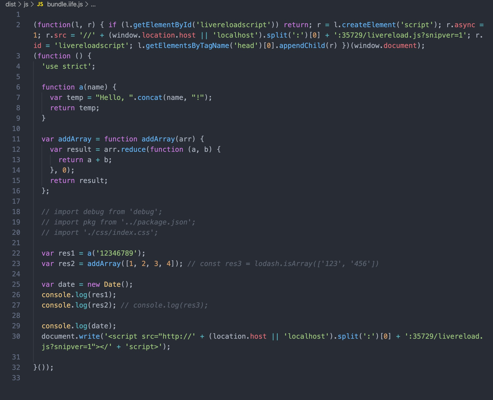
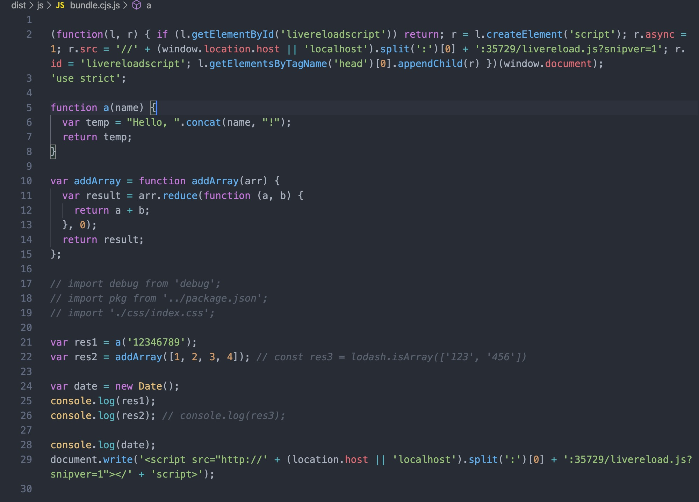
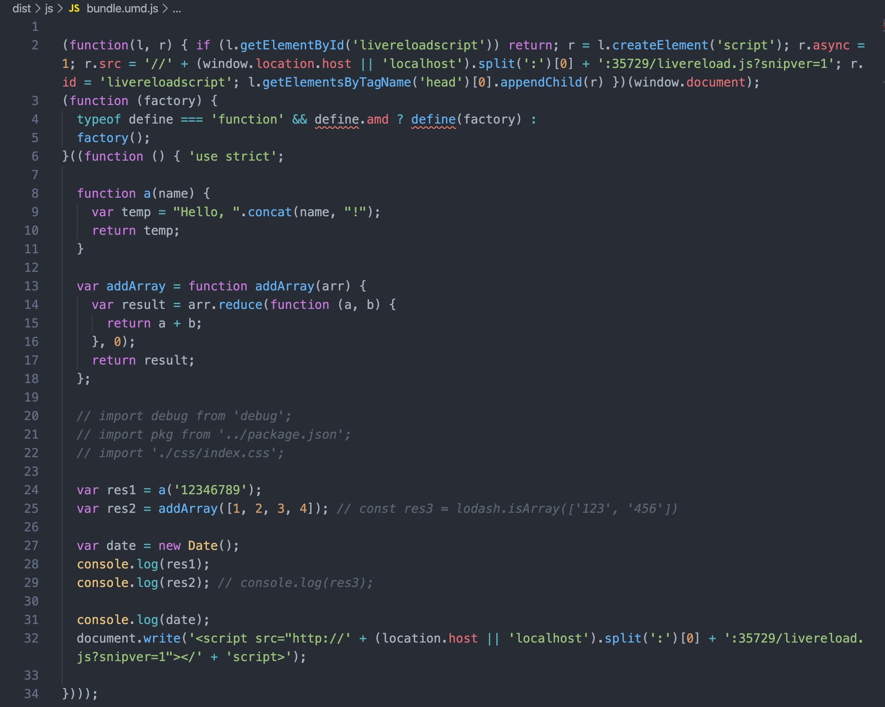
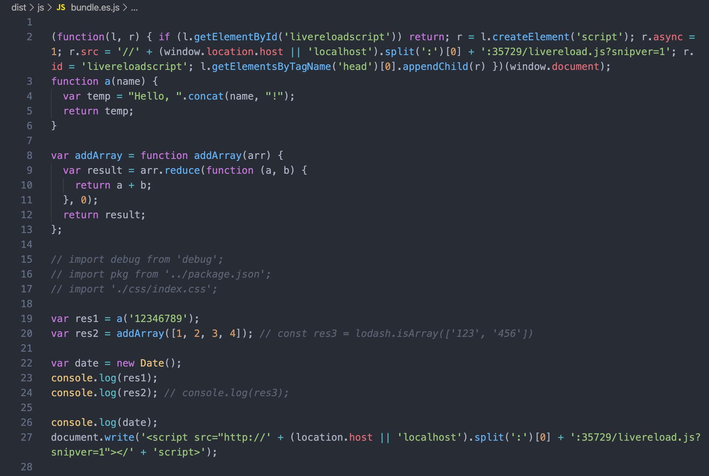
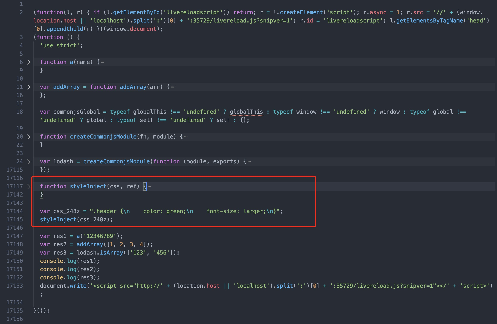

# rollup

### 一：什么是Rollup?
> [rollup](https://github.com/rollup/rollup)

对于前端项目来说，因为有静态资源（如图片、字体等）加载与按需加载的需求，所以使用 `webpack` 是不二选择，但对于第三方库来说，其实还有更好的选择：`rollup`。当我们使用**ES6模块**编写应用或者库时，它可以打包成一个单独文件提供浏览器和Node.js来使用

webpack 在打包成第三方库的时候只能导出 `amd/commonjs/umd`，而 rollup 能够导出 `amd/commonjs/umd/es6`。使用 rollup 导出 es6 模块，就可以在使用这个库的项目中构建时使用 `tree-shaking` 功能。

对于有样式文件（css、less、scss）、静态资源文件（图片、字体）的前端组件来说，可以使用 `rollup-plugin-postcss` 插件配合 rollup 处理样式文件与静态资源文件。

**Rollup最主要的优点是** 它是基于ES2015模块的，相比于webpack或Browserify所使用的CommonJS模块更加有效率，因为Rollup使用一种叫做
tree-shaking的特性来移除模块中未使用的代码，这也就是说当我们引用一个库的时候，我们只用到一个库的某一段的代码的时候，它不会把所有的代码打包进来，而仅仅打包使用到的代码(webpack2.0+也引入了tree-shaking)

### 二：如何使用Rollup来处理并打包JS文件？

1. 安装 `yarn add rollup --dev`
2. 创建 `rollup.config.js`配置文件(类似webpack)

rollup.config.js 文件内容：
```js
export default {
  input: './src/main.js',
  output: {
    file: './dist/js/main.min.js',
    format: 'iife'
  }
}
```
以上配置的含义：

- **input**： rollup执行的入口文件。
- **output**：rollup 输出的文件。
- **output.format**: rollup支持的多种输出格式(有amd,cjs, es, iife 和 umd)

**iife格式**


**commonjs格式**


**umd格式**


**es6格式**



接着在 `package.json`配置，这样当我们执行 `yarn rollupBuild`即可完成打包
```js
  "scripts": {
    "rollupBuild": "rollup -c",
  },
```

先来看一个简单的栗子：

文件的结构如下：
```
- src
  - utils
    - a.js
    - b.js
  - css
    - index.css
  - index.js
  - index.html
- rollup.config.js
- babel.config.js
- package.json
```

a.js 文件内容
```js
export function a(name) {
    const temp = `Hello, ${name}!`;
    return temp;
  }
  export function b(name) {
    const temp = `Later, ${name}!`;
    return temp;
  }
```
b.js 文件内容
```js
const addArray = arr => {
    const result = arr.reduce((a, b) => a + b, 0);
    return result;
  };
  export default addArray;
```

index.js 文件内容
```js
import { a } from './utils/a';
import addArray from './utils/b';

const res1 = a('1234');
const res2 = addArray([1, 2, 3, 4]);

console.log(res1);
console.log(res2);

```

执行`yarn rollupBuild`**打包后**的 main.min.js 文件
```js
(function () {
  'use strict';

  function a(name) {
      const temp = `Hello, ${name}!`;
      return temp;
    }

  const addArray = arr => {
      const result = arr.reduce((a, b) => a + b, 0);
      return result;
    };

  const res1 = a('1234');
  const res2 = addArray([1, 2, 3, 4]);

  console.log(res1);
  console.log(res2);

}());

```

从上面可以看到`a.js`中的 b 函数没有被使用，所以打包就没有被打包进来。细心的朋友会发现，上面引用了一个箭头函数，虽然 rollup支持了解析 **import**和**export**两种语法，但却不会将其他的 ES6代码转换成ES5，如果是旧版的浏览器，不支持ES6的话是无法直接使用的，这时候就需要添加**Babel**

### 设置 Babel 使旧版本浏览器支持 ES6

首先安装一些相关依赖
```
@babel/core
@rollup/plugin-babel // 一个Rollup插件，用于Rollup和Babel之间的无缝集成
```

创建`babel.config.js`文件
```js
module.exports = {
  presets: [
    [
      "@babel/preset-env",
      {
        // "amd"|"umd"|"systemjs"|"commonjs"|"cjs"|"auto"|false，默认为"auto"
        "modules": false, // 启用将 ES6模块语法转换为其他模块类型的功能。要设置false（则不会转换模块），否则 Babel会在 rollup 有机会做处理前将模块转换成其他模式
      }
    ]
  ],
  plugins: [
    ["@babel/plugin-transform-runtime"]
  ]
}

```
（有关预设配置 [https://www.babeljs.cn/docs/babel-preset-env](https://www.babeljs.cn/docs/babel-preset-env)）

配置好`babel.config.js`文件，现在将插件添加进`rollup.config.js`，为了避免转译第三方插件，需要设置一个`exclude`选项忽略`node_modules`目录下的所有文件
```js
import babel from '@rollup/plugin-babel';

export default {
  input: './src/main.js',
  output: {
    file: './dist/js/main.min.js',
    format: 'iife'
  },
  plugins: [
    babel({
      exclude: 'node_modules/**',  // 排除node_module下的所有文件
      babelHelpers: 'runtime' // 结合 @babel/plugin-transform-runtime 使用
    })
  ]
}
```

`babelHelpers`的选项：(默认为 bundled)
- **runtime** ：使用 rollup构建库时，应该选择此配置，必须配合`@babel/plugin-transform-runtime`使用，并将其指定`@babel/runtime`为包的依赖项(捆绑 cjs& es格式时，不要忘了告诉 rollup将其视为外部依赖项)
- **bundled** ：如果要让结果包包含那些帮助程序(每个帮助程序最多一个副本)，则应该使用该选项
- **external** ：将在**全局**`babelHelpers`对象上引用帮助程序，与`@babel/plugin-external-helpers`结合使用
- **inline** ：不建议使用此选项，将会在每个文件中插入帮助程序，会导致代码重复

再打包后`main.min.js`文件内容如下：
```js
(function () {
  'use strict';

  function a(name) {
    var temp = "Hello, ".concat(name, "!");
    return temp;
  }

  var addArray = function addArray(arr) {
    var result = arr.reduce(function (a, b) {
      return a + b;
    }, 0);
    return result;
  };

  var res1 = a('1234');
  var res2 = addArray([1, 2, 3, 4]);
  console.log(res1);
  console.log(res2); 
}());
```

对比没有添加 Babel时打包的结果可以知道，这时候的 addArray箭头函数已经解析成普通的函数，能够运行在较低版本的浏览器

如果需要使用第三方库，像很常用的 lodash，是不是直接 `yarn add`后直接 import进来就能使用呢？我们试试

index.js 文件内容
```js
import { a } from './utils/a';
import addArray from './utils/b';
import lodash from 'lodash'

const res1 = a('1234');
const res2 = addArray([1, 2, 3, 4]);
const isArray = lodash.isArray(['123', '456'])

console.log(res1);
console.log(res2);
console.log(isArray);

```
打包后的 main.min.js文件内容
```js
(function (lodash) {
  'use strict';

  lodash = lodash && Object.prototype.hasOwnProperty.call(lodash, 'default') ? lodash['default'] : lodash;

  function a(name) {
    var temp = "Hello, ".concat(name, "!");
    return temp;
  }

  var addArray = function addArray(arr) {
    var result = arr.reduce(function (a, b) {
      return a + b;
    }, 0);
    return result;
  };

  var res1 = a('1234');
  var res2 = addArray([1, 2, 3, 4]);
  var res3 = lodash.isArray(['123', '456']);
  console.log(res1);
  console.log(res2);
  console.log(res3);
}(lodash));

```

index.html 文件内容
```html
<!doctype html>
<html lang="en">
<head>
  <meta charset="utf-8">
  <meta name="viewport"
        content="width=device-width,minimum-scale=1,initial-scale=1">
  <title>Learning Rollup</title>
</head>
<body>

  <p class="header">
    Let’s learn how to use <a href="http://rollupjs.org/">Rollup</a>.
  </p>
  <!-- This is the bundle generated by rollup.js -->
  <script src="../dist/js/main.min.js"></script>
</body>
</html>
```

当我们直接访问 index.html时，会发现浏览器报错了 `Uncaught ReferenceError: lodash is not defined`

为什么会是 undefined呢？这是因为一般情况下，第三方 node模块并不会被 rollup直接加载，node模块使用的是 CommonJs规范，因此不会兼容 rollup而直接被使用，为了解决这个问题，可以添加一些插件来处理 node依赖和 CommonJs模块

### 插件

**rollup-plugin-node-resolve**： 允许加载 node_modules中的第三方模块

**rollup-plugin-commonjs**：将 CommonJs模块转换为ES6来为 rollup兼容

在 rollup.config.js中添加插件
```js
import babel from '@rollup/plugin-babel';
import resolve from 'rollup-plugin-node-resolve';
import commonjs from 'rollup-plugin-commonjs';

export default {
  input: './src/main.js',
  output: {
    file: './dist/js/main.min.js',
    format: 'iife'
  },
  plugins: [
    babel({
      exclude: 'node_modules/**',  // 排除node_module下的所有文件
      babelHelpers: 'runtime' // 结合 @babel/plugin-transform-runtime 使用
    }),
    resolve({
      jsnext: true, // 该属性是指定将Node包转换为ES2015模块
      main: true, // main 和 browser 属性将使插件决定将那些文件应用到bundle中
      browser: true
    }),
    commonjs()
  ]
}
```

这时，我们重新打包一次，再打开 index.html浏览器就能正常显示不会报错啦

此时打包结果为：


可以看到，整个 lodash库都被打包进来了，代码量一下子就多了起来，能不能让他们作为单独的模块或文件来引用？这时候可以利用 rollup的 **external**属性，在配置文件`rollup.config.js`中添加：

```js
output: {
    file: './dist/js/bundle.iife.js',
    format: 'iife',
    // ++
    globals: {
        lodash: '_'
    },
    // ++
    external: ['lodash']
}
```

**external** 这个配置是用来表示一个模块是否要被当成外部模块使用，属性的值可以是一个字符串数组或一个方法，当传入的是一个字符串数组，这个数组内的模块名都会被当成是外部模块，不会打包到最终的文件

**globals** 这个配置是一个对象，key使用的是模块名称（npm模块名），value表示在打包文件中引用的全局变量名

注意：使用 external配置后，需要从外部重新引入(如 cdn方式)这个模块，否者就会报错:


外部引入模块：
```html
// ++
  <script src="https://cdn.bootcss.com/lodash.js/4.17.15/lodash.core.js"></script>
  
  <script src="../dist/js/bundle.iife.js"></script>
```

**rollup-watch**: 监听文件变化，即时打包

接着在 `package.json`配置，这样当我们执行 `yarn rollupBuild`即可完成打包
```js
  "scripts": {
    "rollupBuild": "rollup -c",
    "watch": "rollup -c -w"
  },
```
执行一遍 `yarn watch`后，我们直接打开 index.html文件，直接修改 index.js的内容就能触发 watch重新打包并在浏览器更新变化了

补充：如果不想监听某些文件变化 可以在 `rollup.config.js`配置文件中加上：
```js
import watch from 'rollup-watch'
//++
plugins: [
  watch: {
    exclude: 'node_modules/**'  // 排除node_module下的所有文件
  }
]

```

**rollup-plugin-serve**: 开启本地服务

在 rollup.config.js中添加插件
```js
import babel from '@rollup/plugin-babel';
import resolve from 'rollup-plugin-node-resolve';
import commonjs from 'rollup-plugin-commonjs';
import serve from 'rollup-plugin-serve';

export default {
  input: './src/main.js',
  output: {
    file: './dist/js/main.min.js',
    format: 'iife'
  },
  plugins: [
    babel({
      exclude: 'node_modules/**',  // 排除node_module下的所有文件
      babelHelpers: 'runtime' // 结合 @babel/plugin-transform-runtime 使用
    }),
    resolve({
      jsnext: true, // 该属性是指定将Node包转换为ES2015模块
      main: true, // main 和 browser 属性将使插件决定将那些文件应用到bundle中
      browser: true
    }),
    commonjs(),
    serve({
      open: true, // 是否打开浏览器
      contentBase: '.', // 入口html的文件位置
      historyApiFallback: false, // Set to true to return index.html instead of 404
      host: 'localhost',
      port: 10001 // 需要五位数
    }),
  ]
}
```

当我们执行 `yarn rollupBuild`时，就能自动打开 http://localhost:10001/了，由于设置的的是根路径，还需要添加成 calhost:10001/src/index.html 才能真正访问目标文件

**rollup-plugin-livereload**: 实时刷新界面

注入LiveReload脚本：

在LiveReload工作前，需要向页面中注入一段脚本用于和LiveReload的服务器建立连接。

在 index.js 中加入如下一段代码：
```js
// Enable LiveReload
document.write(
  '<script src="http://' + (location.host || 'localhost').split(':')[0] +
  ':35729/livereload.js?snipver=1"></' + 'script>'
);
```
接着运行命令去监听目录：

```./node_modules/.bin/livereload 'src/'```

会得到如下结果；Starting LiveReload v0.9.1 for /Users/kayliang/Documents/个人提升/前端/vue-demo/babel-temp/src on port 35729.

告诉我们监听成功，这时我们执行 `yarn rollupBuid` 后打开 index.html文件，在index.html修改内容后保存会看到页面自动刷新内容了

我们还可以这样优化：在 package.json的 scripts中添加命令：
```json
"scripts": {
  "watch": "rollup -c -w",
  "rollupBuild": "rollup -c",
  "reload": "livereload 'src/'"
}, 
```
就能简化过程，无需执行 ```./node_modules/.bin/livereload 'src/'``` 命令

但这个插件只能监听 src下的文件变化，并不能再往下监听其他文件，因为它不能自动打包，这需要 watch插件共同完成，但我们又不能同时打开 watch 和 livereload 这就出现了 all插件

**rollup-all**: 共同开启 watch 和 livereload 

rollup-all 旨在使一个终端可以执行多个任务，我们只需要在 package.json中再添加一条脚本：

```json
"scripts": {
  "watch": "rollup -c -w",
  "rollupBuild": "rollup -c",
  "reload": "livereload 'src/'",
  "all": "npm-run-all --parallel watch"
}, 
```
这时我们执行 `yarn all`后刷新浏览器，改变 js或 css，浏览器就能自动加载更新后的代码

**rollup-plugin-postcss**: 打包样式文件

在 index.js文件中引入新的 index.css文件
```js
// ++
import './css/index.css';
```

接着，需要在 rollup.config.js中设置相关配置：
```js
// ++
import postcss from 'rollup-plugin-postcss';

plugins: [
  // ++
  postcss({
      extensions: ['.css']
  })
]
```

执行 `yarn all`后，可以发现，生成的`main.min.js`文件内容如下：



这个 **styleInject()** 函数创建了一个 `<style>`标签并设置了样式，接着便把 css文件添加对应文件的 `<head>`标签中

除此之外，还有几个配合 css较常使用的插件：

**postcss-simple-vars**: 可以使用Sass风格的变量(e.g. myColor: #fff;，color:myColor;)而不是冗长的CSS语法(e.g. :root {--myColor: #fff}，color: var(--myColor))。

**postcss-nested**: 允许使用嵌套规则。实际上我不用它写嵌套规则；

**postcss-cssnext**: 这个插件集使得大多数现代CSS语法(通过最新的CSS标准)可用，编译后甚至可以在不支持新特性的旧浏览器中工作。

**cssnano**: — 压缩，减小输出CSS文件大小。相当于JavaScript中对应的UglifyJS

### 参考资料

- [Rollup.js 教程](https://www.zcfy.cc/article/how-to-bundle-stylesheets-and-add-livereload-with-rollup) —— 比较详细的系列教程。